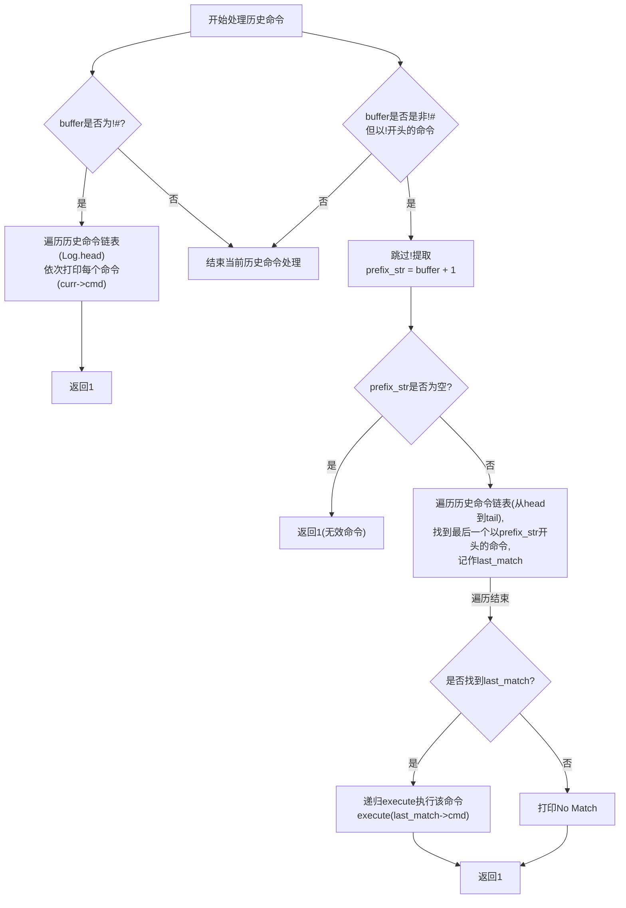
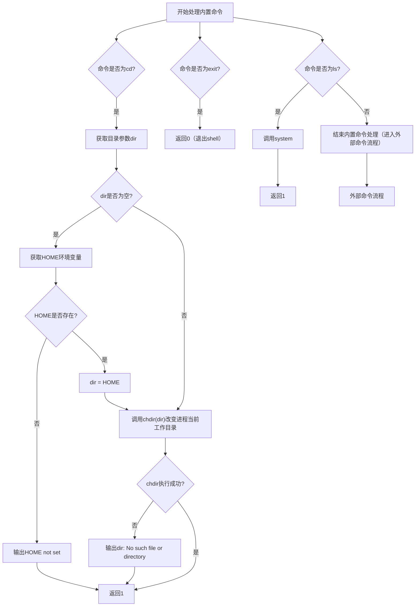
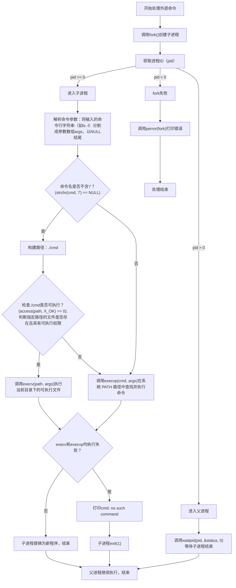
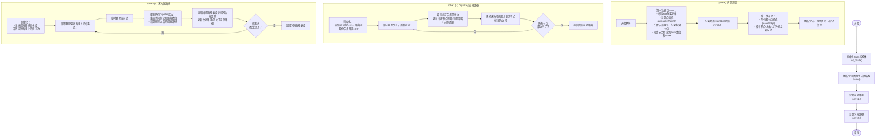
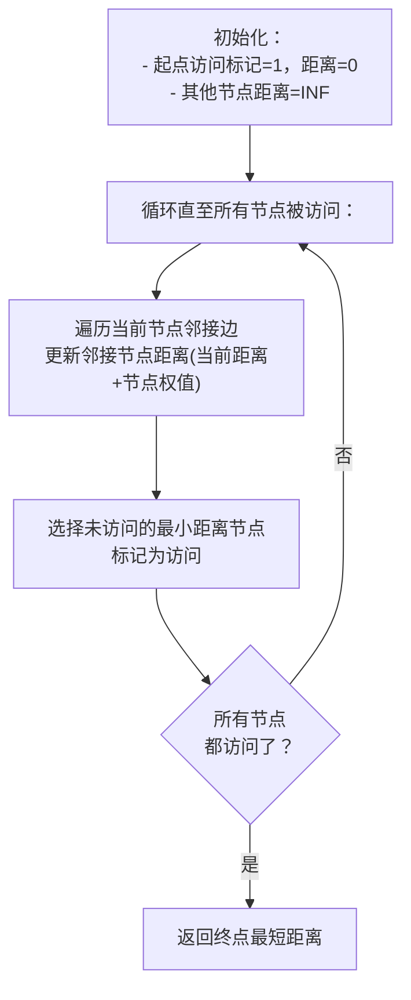
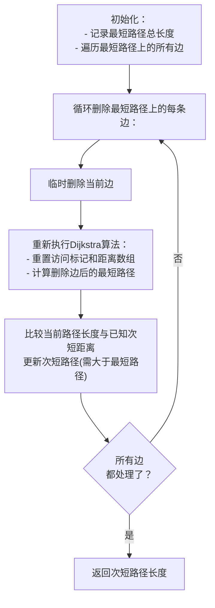
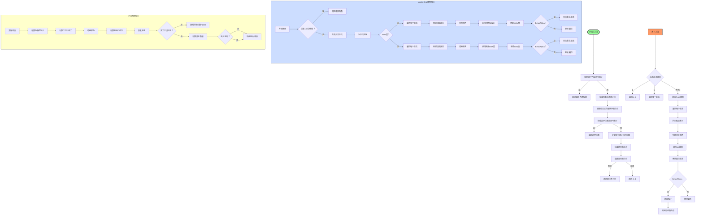

# 第三学期实训项目展示

> By 广八路东湖村八一路远征队 

# 内容组成

- #### 实现自己的Shell
  
- #### 高速路网
  
- #### 黑白棋以及算法优化
  
- #### 蒜头君抢分作战以及优化
  

# 实现自己的Shell

## 要求

- **`log_t`**
  
    - `void log_init(log_t *l)` 初始化栈
      
    - `void log_destroy(log_t* l)` 回收内存
      
    - `void log_push(log_t* l, const char *item)` 入栈（将item字符串插入末尾）
      
    - `char *log_search(log_t* l, const char *prefix)` 查找（包含前缀`prefix`的字符串）
    
- **`shell`**
  
    - `prefix` 输出当前所在目录
      
    - `execute`
      
        - 历史类命令（!# 或 !prefix_str)
          
        - 保存指令 分割命令（对于非历史类命令）
          
        - 实现内置命令（cd 或 exit 或 ls)
          
        - 实现外部指令（DOS指令，先添加./再执行）
          


## 分工

- #### log_t： 祁盛
  
- #### Shell：高安程 王天朔 邢玥茗
  
- #### 调试debug：高安程
  


## 具体实现


### 第一部分：`log_t`

用链表实现的栈，作用是保存输入的每一条命令以便查找。

- `void log_init(log_t *l)` ; 初始化`log_t`-> 将`l`的`head`设置为`NULL`。
  
- `void log_destroy(log_t* l);`销毁`log_t`——回收所有内存，并将`l`的`head`设置为`NULL`
  
- `void log_push(log_t* l, const char *item);`字符串`item`插入到一个`log_t`的末尾
  
- `char *log_search(log_t* l, const char *prefix);`搜索是否有包含前缀`prefix`存在的字符串。搜索不到返回NULL
  


### 第二部分：`shell`

#### `prefix`函数 -> 输出当前所在目录

- 直接用`printf("%s$ ", cwd)`来实现输出以下格式的命令提示符
  
    - `/path/to/cwd$`
      


### execute函数

#### 历史命令类（包含!开头的命令）




#### 分割命令


#### 内置命令




#### 执行外部命令



# 实现高速路网

## 总流程图



## 分工

- ### 建图parse：高安程
  
- ### 最短路径solve1：邢玥茗
  
- ### 次短路径solve2：王天朔
  
- ### 调试：祁盛
  
## 优化设计流程

## 第一版建图

---

- 每个有效节点通过`nodeCnt++`获得唯一的线性编号，不采用二维坐标
  
- 同行相邻的节点编号相邻
  
- 相邻行相邻的节点以第一行的列数（`maxLine`）作为跨行连接的 “基准”，推算编号（通过`nodeCnt - maxLine`等计算上一行节点）
  
- **建边逻辑复杂，不直观**：奇偶行的差异化规则增加了代码理解和维护成本，且需严格保证节点编号与行、列的对应关系（否则易出现连接错误）。
  

```C++
void buildEdge(struct State *s, int weight, int column) { 
	int maxLine = s -> column; 
	Points[++nodeCnt].weight = weight; 
	if (s -> row % 2 == 0) { 
		addEdge(nodeCnt, nodeCnt - maxLine); 
		addEdge(nodeCnt - maxLine + 1, nodeCnt); 
	} else if (s -> row % 2 == 1) { 
		if (s -> row > 1) { 
			if (column < maxLine) { 
				addEdge(nodeCnt, nodeCnt - (maxLine - 1)); 
				} 
			if (column > 1) { 
				addEdge(nodeCnt, nodeCnt - maxLine); 
			} 
		} 
	} 
	if (column > 1) {
		addEdge(nodeCnt, nodeCnt - 1); 
	} 
}
```


## 第二版建图

---

- 将节点编号改为二维的方式
  
- 优点：**依照空间邻接关系来建模更为合理，更贴近真实场景** ：
  
    - 边的建立不仅考虑同一行的左右相邻，还通过 “奇偶行差异化” 处理上下行的交错邻接，模拟了二维空间中节点的自然邻接关系（类似网格或蜂窝结构）
      
        ```C++
        void insertEdge(int u, int v)
        {
            edge[++edgeNum].vertex = v;
            edge[edgeNum].next = head[u];
            head[u] = edgeNum;
        } // 插边 有向
        
        void parse(struct State *s, struct PNG *p)
        {
            int height = p->height;
            int width = p->width;
            int weight;
            int row = 0, col = 0;
            int firstId = 0, lastId = 0;
        
            // 第一次遍历：分配编号和权值
            for (int h = 6; h < height; h += 8)
            {
                col = 0;
                for (int w = 6; w < width; w += 8)
                {
                    weight = calculateWeight(p, w, h);
                    if (weight == 0)
                    {
                        s->valid[row][col] = 0;
                        col++;
                        continue;
                    }
                    s->nodeCnt++;
                    nodeNum = s->nodeCnt; // 同步全局变量
                    s->id[row][col] = s->nodeCnt;
                    s->points[row][col] = weight;
                    s->valid[row][col] = 1;
                    Point[s->nodeCnt].weight = weight; // 同步到Point数组
        
                    if (row == 0 && col == 0)
                        firstId = s->nodeCnt;
                    lastId = s->nodeCnt;
                    col++;
                }
                row++;
            }
            s->row = row;
            s->column = col; // 最后一行的列数
            s->startId = firstId;
            s->endId = lastId;
        
            // 第二次遍历：建边
            for (int i = 0; i < s->row; i++)
            {
                for (int j = 0; j < s->column; j++)
                {
                    if (!s->valid[i][j])
                        continue;
                    int u = s->id[i][j];
        
                    // 左邻居
                    if (j > 0 && s->valid[i][j - 1])
                    {
                        int v = s->id[i][j - 1];
                        insertEdge(u, v);
                        insertEdge(v, u);
                    }
        
                    // 上方邻居（奇偶行不同）
                    if (i > 0)
                    {
                        if (i % 2 == 0)
                        {
                            // 偶数行：左上(i-1,j-1), 右上(i-1,j)
                            if (j > 0 && s->valid[i - 1][j - 1])
                            {
                                int v = s->id[i - 1][j - 1];
                                insertEdge(u, v);
                                insertEdge(v, u);
                            }
                            if (s->valid[i - 1][j])
                            {
                                int v = s->id[i - 1][j];
                                insertEdge(u, v);
                                insertEdge(v, u);
                            }
                        }
                        else
                        {
                            // 奇数行：左上(i-1,j), 右上(i-1,j+1)
                            if (s->valid[i - 1][j])
                            {
                                int v = s->id[i - 1][j];
                                insertEdge(u, v);
                                insertEdge(v, u);
                            }
                            if (j < s->column - 1 && s->valid[i - 1][j + 1])
                            {
                                int v = s->id[i - 1][j + 1];
                                insertEdge(u, v);
                                insertEdge(v, u);
                            }
                        }
                    }
                }
            }
            return;
        }
        ```
        
        

## Solve1流程图



## Solve2流程图




# 黑白棋

## 总流程图



## 任务内容

- ##### 写出自己的AI与对方AI对战。
  
- ##### 在经典黑白棋规则的基础之上，增加一个额外信息：棋子分数。对于棋盘上的每个格子，均有一个 1 至 9 之间的分数，格子上的分数属于格子上的棋子所属人。
  
  
## 任务细节

---

- ### 任务一
  
    地图中所有格子除了中间四个以外均为1。
    
- ### 任务二
  
    地图中所有格子除了中间四个**四个角**以外的分数均为1。
    
- ### 任务三
  
    地图中所有格子除了**中间四个以及最外层一圈**以外的格子分数均为 1。
    
- ### 任务四
  
    地图上的格子分数无额外限制。
    

## 具体实现

## 代码内函数基本介绍

### 一、初始化与工具函数

1. `init(struct Player *player)`
  
    - 功能：每局游戏开始时初始化 AI，调用`init_opponent`初始化对手走法优先级矩阵。
    
2. `init_opponent(struct Player *player)`
  
    - 功能：初始化对手相关参数，记录初始棋子位置到`start_point`数组。
    
3. `copy_player(struct Player* dest, const struct Player* src)`
  
    - 功能：深拷贝玩家状态（棋盘、分数、行列数等），用于假设性走棋时保存原状态。
    
4. `free_player_mat(struct Player* player)`
  
    - 功能：释放玩家棋盘矩阵的动态内存，避免内存泄漏。
    
5. `in(struct Player *player,int x,int y)`
  
    - 功能：判断坐标`(x,y)`是否在棋盘范围内。
      
### 二、合法性检查函数

1. `is_valid(int row_cnt,int col_cnt,char mat[][30], int posx, int posy,char my_sign,char his_sign)`
  
    - 功能：检查在指定棋盘`mat`中，`(posx,posy)`位置是否为`my_sign`的合法落子（能翻转`his_sign`的棋子）。
    
2. `is_avalid(struct Player *player, int posx, int posy)`
  
    - 功能：检查当前玩家（己方，`'O'`）在`(posx,posy)`的落子是否合法（封装`is_valid`，固定己方为`'O'`，对手为`'o'`）。
    
3. `find_all_legal_moves(struct Player* player, struct Point legal_moves[])`
  
    - 功能：查找当前玩家的所有合法落子，存储到`legal_moves`数组，返回合法走法数量。
    
4. `count_legal_moves(struct Player* player)`
  
    - 功能：统计当前玩家的合法落子数量（行动力评估的基础）。
      
### 三、走法预测与选择函数

1. `judge_corner(struct Player *player)`
  
    - 功能：检查四个角落是否为己方合法落子，优先选择角落位置。
    
2. `judge_side(struct Player *player)`
  
    - 功能：检查棋盘边缘（非角落）的合法落子，优先选择能巩固边缘控制的位置。
    
3. `calc_grade(struct Player *player)`
  
    - 功能：计算每个合法落子的 “分数”（基于翻转对手棋子的数量和位置权重），用于排序。
    
4. `partition(int s,int t)`、`QuickSort(int s,int t)`
  
    - 功能：快速排序算法，用于对合法落子按`calc_grade`计算的分数排序。
    
5. `select_point(struct Player *player)`
  
    - 功能：从排序后的合法落子中选择最优位置，考虑稳定性、角落保护等策略。
    
6. `predict_opponent_move(struct Player *player)`
  
    - 功能：预测对手的最佳落子位置（模拟对手视角的走法选择）。
      

### 四、棋盘状态处理函数

1. `switch_perspective(struct Player* player)`
  
    - 功能：切换棋盘视角（交换己方`'O'`和对手`'o'`的棋子，交换分数），用于模拟对手回合。
    
2. `make_hypothetical_move(struct Player* player, struct Point move)`
  
    - 功能：在指定玩家的棋盘上执行假设性落子，并翻转所有被夹住的对手棋子（用于搜索时模拟走棋）。
    
3. `judge_stable(struct Player *player)`
  
    - 功能：判断棋盘上的 “稳定棋子”（不会被对手翻转的棋子），标记到`map`数组中。
    
4. `exclude_position(struct Player *player,int x,int y)`
  
    - 功能：判断`(x,y)`是否为需要排除的危险位置（可能导致对手抢占角落）。
    
5. `get_late_game_threshold(struct Player *player)`
  
    - 功能：根据棋盘大小计算 “残局阈值”（棋子总数达到该值时，评估函数更侧重棋子数量）。
      

### 五、评估与搜索函数

1. `evaluate_state(struct Player *player)`
  
    - 功能：评估当前棋盘状态的分数，综合考虑角落控制、行动力、棋子数量（残局）三个因素，加权计算。
    
2. `compare_moves(const void *a, const void *b)`
  
    - 功能：用于`qsort`的比较函数，按对手优先级降序排序合法走法，优化 Alpha-Beta 剪枝效率。
    
3. `alpha_beta(struct Player *player, int depth, int alpha, int beta, bool is_maximizing_player)`
  
    - 功能：Alpha-Beta 剪枝搜索核心，递归评估各走法的优劣，返回最佳评估值（MAX 层最大化分数，MIN 层最小化分数）。
    
4. `place(struct Player *player)`
  
    - 功能：AI 的核心落子决策函数，调用`alpha_beta`搜索选择最优落子位置，处理特殊情况（无合法走法或唯一走法）。
      

## 关键函数详细讲解


### 1. `evaluate_state(struct Player *player)`

- 评估当前棋盘状态的分数，综合考虑角落控制、行动力、棋子数量三个因素
  
  ```C++
  int evaluate_state(struct Player *player) {
      int corner_score = 0;    // 角落控制得分
      int mobility_score = 0;  // 行动力得分
      int piece_score = 0;     // 棋子数量得分
  
      // 1. 角落控制评估（4个角落位置）
      int r = player->row_cnt - 1;
      int c = player->col_cnt - 1;
      char corners[4] = {player->mat[0][0], player->mat[0][c], player->mat[r][0], player->mat[r][c]};
      for (int i = 0; i < 4; i++) {
          if (corners[i] == 'O') corner_score++;      // 己方角落+1
          else if (corners[i] == 'o') corner_score--; // 对方角落-1
      }
  
      // 2. 行动力评估（计算双方合法走法数量差）
      int my_moves = count_legal_moves(player);
      switch_perspective(player);
      int opponent_moves = count_legal_moves(player);
      switch_perspective(player); // 恢复视角
      
      if (my_moves + opponent_moves != 0) {
          mobility_score = (my_moves - opponent_moves);
      } else {
          // 终局状态（双方都无棋可走），直接计算棋子数量差
          int my_final_score = 0;
          int opp_final_score = 0;
          for (int i = 0; i < player->row_cnt; i++) {
              for (int j = 0; j < player->col_cnt; j++) {
                  if (player->mat[i][j] == 'O') my_final_score++;
                  else if (player->mat[i][j] == 'o') opp_final_score++;
              }
          }
          return (my_final_score - opp_final_score) * 1000; // 终局分数放大
      }
  
      // 3. 棋子数量评估（仅在残局阶段考虑）
      int my_pieces = 0;
      int opp_pieces = 0;
      for (int i = 0; i < player->row_cnt; i++) {
          for (int j = 0; j < player->col_cnt; j++) {
              if (player->mat[i][j] == 'O') my_pieces++;
              else if (player->mat[i][j] == 'o') opp_pieces++;
          }
      }
      if (my_pieces + opp_pieces > get_late_game_threshold(player)) {
          piece_score = my_pieces - opp_pieces;
      }
  
      // 加权综合评估（角落权重最高，行动力次之，残局棋子数量重要）
      return (W_CORNER * corner_score) + (W_MOBILITY * mobility_score) + (W_PIECE_COUNT * piece_score);
  }
  ```
  
  

### **关键点**：

- ##### **角落控制**：角落位置（如`(0,0)`）对游戏胜负影响极大，得分为 ±1。
  
- ##### **行动力**：当前可走步数多的一方更具优势，得分为`我方步数 - 对方步数`。
  
- ##### **残局策略**：当棋子总数超过阈值（如 64 格棋盘为 37）时，转为重视棋子数量。
  

##### 2. `alpha_beta(struct Player *player, int depth, int alpha, int beta, bool is_maximizing_player)`

- Alpha-Beta 剪枝算法的核心实现，递归搜索最优走法，减少不必要的计算
  
    ```C++
    int alpha_beta(struct Player *player, int depth, int alpha, int beta, bool is_maximizing_player) {
        struct Point legal_moves[player->row_cnt * player->col_cnt];
        int num_legal_moves = find_all_legal_moves(player, legal_moves);
    
        // 终止条件：达到搜索深度或无合法走法
        if (depth == 0 || num_legal_moves == 0) {
            if (num_legal_moves == 0) {
                switch_perspective(player);
                bool opponent_has_moves = count_legal_moves(player) > 0;
                switch_perspective(player);
                if (!opponent_has_moves) {
                    return evaluate_state(player) * 10; // 游戏结束，放大分数
                }
            }
            return evaluate_state(player);
        }
        
        // 走法排序（按对手优先级）优化剪枝效率
        qsort(legal_moves, num_legal_moves, sizeof(struct Point), compare_moves);
    
        if (is_maximizing_player) { // MAX层（我方回合）
            int max_eval = INT_MIN;
            for (int i = 0; i < num_legal_moves; i++) {
                struct Player board_copy;
                copy_player(&board_copy, player);
                make_hypothetical_move(&board_copy, legal_moves[i]);
                
                // 递归评估对手回合（MIN层）
                switch_perspective(&board_copy);
                int eval = alpha_beta(&board_copy, depth - 1, alpha, beta, false);
                free_player_mat(&board_copy);
                
                max_eval = (eval > max_eval) ? eval : max_eval;
                alpha = (alpha > max_eval) ? alpha : max_eval;
                if (beta <= alpha) break; // Beta剪枝
            }
            return max_eval;
        } 
        else { // MIN层（对手回合）
            int min_eval = INT_MAX;
            for (int i = 0; i < num_legal_moves; i++) {
                struct Player board_copy;
                copy_player(&board_copy, player);
                make_hypothetical_move(&board_copy, legal_moves[i]);
                
                // 递归评估我方回合（MAX层）
                switch_perspective(&board_copy);
                int eval = alpha_beta(&board_copy, depth - 1, alpha, beta, true);
                free_player_mat(&board_copy);
    
                min_eval = (eval < min_eval) ? eval : min_eval;
                beta = (beta < min_eval) ? beta : min_eval;
                if (beta <= alpha) break; // Alpha剪枝
            }
            return min_eval;
        }
    }
    ```
    
    

### **关键点**：

- ##### **剪枝优化**：通过 Alpha（MAX 下限）和 Beta（MIN 上限）的比较，提前放弃不可能的分支
  
- ##### **递归搜索**：交替模拟我方（MAX 层）和对手（MIN 层）的最优决策
  
- ##### **走法排序**：使用`compare_moves`对走法预排序，提高剪枝效率
  

### 3. `place(struct Player *player)`

- AI 的主决策函数，调用 Alpha-Beta 搜索选择最优落子位置
  
    ```C++
    struct Point place(struct Player *player) {
        struct Point legal_moves[player->row_cnt * player->col_cnt];
        int num_legal_moves = find_all_legal_moves(player, legal_moves);
    
        // 特殊情况处理
        if (num_legal_moves == 0) return initPoint(-1, -1); // 无合法走法
        if (num_legal_moves == 1) return legal_moves[0];   // 唯一走法
    
        // Alpha-Beta搜索初始化
        int max_score = INT_MIN;
        struct Point best_move = legal_moves[0];
        int alpha = INT_MIN;
        int beta = INT_MAX;
    
        // 遍历所有合法走法，选择评估分数最高的
        qsort(legal_moves, num_legal_moves, sizeof(struct Point), compare_moves);
        for (int i = 0; i < num_legal_moves; i++) {
            struct Player hypothetical_board;
            copy_player(&hypothetical_board, player);
            make_hypothetical_move(&hypothetical_board, legal_moves[i]);
            
            // 递归评估对手回合
            switch_perspective(&hypothetical_board);
            int score = alpha_beta(&hypothetical_board, SEARCH_DEPTH - 1, alpha, beta, false);
            free_player_mat(&hypothetical_board);
            
            if (score > max_score) {
                max_score = score;
                best_move = legal_moves[i];
            }
            alpha = (alpha > max_score) ? alpha : max_score;
        }
    
        return best_move;
    }
    ```
    
    
### **关键点**：

- ##### **特殊情况处理**：直接返回唯一走法或无合法走法。
  
- ##### **搜索深度**：通过`SEARCH_DEPTH`（默认 4）控制递归层数，平衡计算效率和决策质量。
  
- ###### **走法评估**：对每个合法走法生成假设棋盘，调用 Alpha-Beta 评估分数。
  

### 4. `make_hypothetical_move(struct Player* player, struct Point move)`

- 在假设棋盘上执行落子，并翻转被夹住的对手棋子
  
    ```C++
    void make_hypothetical_move(struct Player* player, struct Point move) {
        if (move.X == -1 && move.Y == -1) return;
    
        int posx = move.X;
        int posy = move.Y;
        player->mat[posx][posy] = 'O'; // 放置己方棋子
    
        // 8个方向处理被夹住的棋子
        int step[8][2] = {0, 1, 0, -1, 1, 0, -1, 0, 1, 1, -1, -1, 1, -1, -1, 1};
        for (int dir = 0; dir < 8; dir++) {
            int x = posx + step[dir][0];
            int y = posy + step[dir][1];
            
            // 相邻位置必须是对方棋子
            if (x < 0 || x >= player->row_cnt || y < 0 || y >= player->col_cnt || player->mat[x][y] != 'o') {
                continue;
            }
    
            // 查找该方向的终止位置（己方棋子）
            int line_end_x = -1, line_end_y = -1;
            while (true) {
                x += step[dir][0];
                y += step[dir][1];
                if (x < 0 || x >= player->row_cnt || y < 0 || y >= player->col_cnt || 
                    (player->mat[x][y] >= '1' && player->mat[x][y] <= '9')) {
                    break;
                }
                if (player->mat[x][y] == 'O') {
                    line_end_x = x;
                    line_end_y = y;
                    break;
                }
            }
    
            // 翻转被夹住的对方棋子
            if (line_end_x != -1) {
                int cx = posx + step[dir][0];
                int cy = posy + step[dir][1];
                while (cx != line_end_x || cy != line_end_y) {
                    player->mat[cx][cy] = 'O'; // 翻转
                    cx += step[dir][0];
                    cy += step[dir][1];
                }
            }
        }
    }
    ```
    
    

### **关键点**：

- ##### **方向检测**：检查 8 个方向上是否存在被夹住的对手棋子链。
  
- ##### **棋子翻转**：从落子点出发，找到链的两端（己方棋子），将中间的对手棋子全部翻转。
  

##### 5. `is_valid(int row_cnt,int col_cnt,char mat[][30], int posx, int posy,char my_sign,char his_sign)`

- 检查在指定位置落子是否合法（可翻转对手棋子)
  
    ```C++
    int is_valid(int row_cnt,int col_cnt,char mat[][30], int posx, int posy,char my_sign,char his_sign) {
        if (posx < 0 || posx >= row_cnt || posy < 0 || posy >= col_cnt) {
            return false;
        }
        if (mat[posx][posy] == his_sign || mat[posx][posy] == my_sign) {
            return false;
        }
        
        // 8个方向检查
        int step[8][2] = {0, 1, 0, -1, 1, 0, -1, 0, 1, 1, -1, -1, 1, -1, -1, 1};
        for (int dir = 0;  dir < 8; dir++) {
            int x = posx + step[dir][0];
            int y = posy + step[dir][1];
            
            // 相邻位置必须是对方棋子
            if (x < 0 || x >= row_cnt || y < 0 || y >= col_cnt || mat[x][y] != his_sign) {
                continue;
            }
            
            // 沿该方向搜索己方棋子
            while (true) {
                x += step[dir][0];
                y += step[dir][1];
                if (x < 0 || x >= row_cnt || y < 0 || y >= col_cnt || 
                    (mat[x][y] >= '1' && mat[x][y] <= '9')) {
                    break;
                }
                if (mat[x][y] == my_sign) {
                    return true; // 找到己方棋子，此方向合法
                }
            }
        }
        return false;
    }
    ```
    
    

### **关键点**：

- ##### **边界检查**：确保落子位置在棋盘内且为空。
  
- ##### **方向合法性**：只要有一个方向能形成 “对手棋子链” 且链的末端是己方棋子，则合法。
  

### 总结

这些函数共同构成了一个完整的黑白棋 AI 决策系统：

- **评估函数**（`evaluate_state`）提供局面价值判断，指导搜索方向。
  
- **Alpha-Beta 剪枝**（`alpha_beta`）通过递归搜索找到最优走法，优化计算效率。
  
- **走法执行**（`make_hypothetical_move`）和**合法性检查**（`is_valid`）确保 AI 的每一步都符合游戏规则。
  
- **主决策函数**（`place`）整合所有逻辑，输出最终落子位置。

## 黑白棋算法优化
### 任务1任务2优化思路
- 在从minimax+alphabeta剪枝和蒙特卡洛搜索树中选择了更好的minimax+alphabeta，完成了代码的整体架构后，我们发现地图的上不同点的权重对分数会有很大的影响，例如四个角的权重是最重的，但是与四个角相邻的点很危险，参考了下图我们做出了最优的地图权重设计。
![[5117ee53e0921cc9ab0ea4ddbd22e23b.png]]
设计如下
```C++
const int position_value_8x8[8][8] = { 
{200, -25, 10, 5, 5, 10, -25, 200}, 
{-25, -45, 1, 1, 1, 1, -45, -25}, 
{ 10, 1, 3, 2, 2, 3, 1, 10}, 
{ 5, 1, 2, 1, 1, 2, 1, 5}, 
{ 5, 1, 2, 1, 1, 2, 1, 5}, 
{ 10, 1, 3, 2, 2, 3, 1, 10}, 
{-25, -45, 1, 1, 1, 1, -45, -25}, 
{200, -25, 10, 5, 5, 10, -25, 200} 
}; 
const int position_value_10x10[10][10] = { 
{200, -25, 10, 8, 5, 5, 8, 10, -25, 200}, 
{-25, -45, 1, 1, 1, 1, 1, 1, -45, -25}, 
{ 10, 1, 3, 2, 2, 2, 2, 3, 1, 10}, 
{ 8, 1, 2, 1, 1, 1, 1, 2, 1, 8}, 
{ 5, 1, 2, 1, 1, 1, 1, 2, 1, 5}, 
{ 5, 1, 2, 1, 1, 1, 1, 2, 1, 5}, 
{ 8, 1, 2, 1, 1, 1, 1, 2, 1, 8}, 
{ 10, 1, 3, 2, 2, 2, 2, 3, 1, 10}, 
{-25, -45, 1, 1, 1, 1, 1, 1, -45, -25}, 
{200, -25, 10, 8, 5, 5, 8, 10, -25, 200} 
}; 
const int position_value_12x12[12][12] = { 
{200, -25, 10, 8, 5, 5, 5, 5, 8, 10, -25, 200}, 
{-25, -45, 1, 1, 1, 1, 1, 1, 1, 1, -45, -25}, 
{ 10, 1, 3, 2, 2, 2, 2, 2, 2, 3, 1, 10}, 
{ 8, 1, 2, 1, 1, 1, 1, 1, 1, 2, 1, 8}, 
{ 5, 1, 2, 1, 1, 1, 1, 1, 1, 2, 1, 5}, 
{ 5, 1, 2, 1, 1, 1, 1, 1, 1, 2, 1, 5}, 
{ 5, 1, 2, 1, 1, 1, 1, 1, 1, 2, 1, 5}, 
{ 5, 1, 2, 1, 1, 1, 1, 1, 1, 2, 1, 5}, 
{ 8, 1, 2, 1, 1, 1, 1, 1, 1, 2, 1, 8}, 
{ 10, 1, 3, 2, 2, 2, 2, 2, 2, 3, 1, 10}, 
{-25, -45, 1, 1, 1, 1, 1, 1, 1, 1, -45, -25}, 
{200, -25, 10, 8, 5, 5, 5, 5, 8, 10, -25, 200} };
```
- 根据地图的大小设置不同的权重，并将权重×该点的分数，作为最终的权值使用

### 任务三优化思路
#### 1.​ 残局处理的加入
- **早期/中局阶段**​：AI更注重控制角落、边线和行动力（可走棋的位置数量），因为这些策略性位置能带来长期优势。
- **残局阶段**​（当剩余空格较少时）：AI会**切换为精确计算棋子数量差**，因为此时每一步都可能直接影响最终胜负，策略性位置的价值降低。
```c
if (my_pieces + opp_pieces > get_late_game_threshold(player)) {
    piece_score = my_pieces - opp_pieces; // 残局阶段才启用棋子数量评估
}
```

- **非残局阶段**​：忽略棋子数量差（`W_PIECE_COUNT`权重仅为2，远低于角落权重100）。
- **残局阶段**​：棋子数量差成为主要评估指标，直接决定走法选择。

>  为什么需要残局处理？
>  1. **数学确定性**​：残局阶段剩余空格少，可通过搜索精确计算最终结果，而非依赖启发式评估
>  2. **策略反转**​：早期控制角落的走法可能在残局导致被动（如被迫让出更多翻转区域）
>  3. **效率优化**​：减少无意义的策略计算，直接聚焦于胜负关键
> 

##### 示例场景
假设8×8棋盘剩余10空格：
- **无残局处理**​：AI可能选择巩固一个角落，但实际会因后续被迫翻转损失更多棋子。
- **有残局处理**​：AI会计算所有可能走法的最终棋子差，选择即使失去角落但总棋子数更多的走法。

通过区分残局与中局策略，AI能在不同阶段动态调整目标，显著提升胜率

### 任务四及比赛优化
#### 残局处理阈值的控制

- 代码中通过 `get_late_game_threshold()` 动态判断残局阈值：
    - 8×8棋盘：剩余 ≤37空格（约58%棋子已放置）
    - 10×10棋盘：剩余 ≤87空格
    - 12×12棋盘：剩余 ≤120空格
- 当棋盘空格数低于阈值时，AI会**优先最大化己方棋子数量**，而非追求角落或边线控制。
```
int get_late_game_threshold(struct Player *_player_) { 
	int total_cells = player->row_cnt * player->col_cnt; 
	if (total_cells == 64) // 8x8棋盘 
		return 37; 
	else if (total_cells == 100) // 10x10棋盘
		return 87; 
	else if (total_cells == 144) // 12x12棋盘 
		return 120;  
	else return (int)(total_cells * 0.625); 
	// 默认使用62.5%作为阈值
}
```

# 蒜头抢分大作战

### 游戏内容
#### 简介
两只蒜头将在一个地图上拼命地抢分，谁最终的分数更高，谁就获得比赛的胜利。与此同时，地图上还有两个破坏者，意图破坏两只蒜头抢分。
#### 规则
##### 角色介绍
1. 游戏只有 2 种角色：蒜头和破坏者。
2. 每局比赛初始均有 2 只蒜头，你需要写出 AI 控制其中一只蒜头在地图上进行各种操作，而另一只蒜头将由其他同学写出的 AI 进行控制。
3. 每局比赛初始均有 2 个破坏者。
4. 保证初始时任意两个角色不会在地图的同一位置中出现。
5. 保证两个破坏者的角色对两位蒜头是绝对公平的。
##### 地图介绍
1. 地图为 n 行 m 列由格子组成的矩阵。每个格子为以下几种类型中的一种：
    - 墙：任何角色都无法移动到这种格子。
    - 地面：角色可以移动到这种格子上。地面上可能有普通星和超级星。每个格子上至多会有一个星星（普通星或超级星）。
2. 各种角色的初始位置都一定是地图中的地面而非墙。
3. 保证地图对两只蒜头是绝对公平的。
4. 我们用坐标 (x - 1, y - 1) 表示地图中第 x 行 y 列的格子，即下标从 0 开始。
##### 移动规则
1. 每个角色当前回合可以移动至上下左右四个相邻地面格子中的一个，或选择不移动。
2. 蒜头和蒜头之间、破坏者和破坏者之间不会发生碰撞。
3. 每个破坏者的移动具有一定的随机性，且会考虑破坏者到两只蒜头的最短距离（从格子 x 移动到格子 y 的最少次数，被称为 x 到 y 的最短距离，注意这并不是曼哈顿距离，因为有障碍物）。若某个破坏者到蒜头 A 的最短距离为 a，到蒜头 B 的最短距离为 b，则该破坏者朝蒜头 A 的方向移动的概率为 a+bb​，朝蒜头 B 的方向移动的概率为 a+ba​。注意，若有两个方向均为最短路方向，则等概率随机选择两个方向中的一个。若有不少于一只蒜头处于强化状态或已经从地图上消失，则破坏者将会等概率随机游走。
4. 若你的 AI 没有移动到合法的下一步位置上，则会被系统认定为自杀。
##### 抢分规则
1. 蒜头和星星重合时，星星会从地图上消失，同时蒜头增加该星星对应的分数。若同时有多只蒜头与同一星星重合，和单独相遇时增加的分数相同。
2. 蒜头和超级星重合时，蒜头会变为强化状态，并获得分数。若两只蒜头同时与超级星重合，则均变为强化状态。且获得的分数与单独相遇时增加的分数相同，具体分数会在积分规则部分介绍。
3. 破坏者和处于普通状态的蒜头重合时，蒜头会从地图上消失，并且不会再进行任何操作，称为破坏者对蒜头的抢分。
4. 破坏者和处于强化状态的蒜头重合时，破坏者会回到比赛初始时的位置。若多个强化状态的蒜头和同一破坏者重合，则和单独相遇时增加的分数相同，具体分数会在积分规则部分介绍。
5. 处于普通状态的蒜头和处于强化状态的蒜头重合时，处于普通状态的蒜头将会从地图上消失，并且不再进行任何操作，称为蒜头对蒜头的抢分。
6. 两个处于强化状态的蒜头重合时，不会发生任何事情。

### 任务内容

#### 任务一
- 在$10×10$，双鬼不动，AI不动的图中，完成自己的AI，达到超过500分。
##### 实现思路
任务一特征
- 鬼不动，AI也不动
- 鬼在墙里面 吃不到
##### 具体实现
完全不管AI 直接以一条最短的路径考考虑在不撞到AI和墙的情况下吃掉所有的能量球即可，理论最高得分550。
#### 任务二
- 在 10×10、单鬼动，AI 不动的地图中，完成自己的 AI，并能够得到超过 500 分。
- 在 10×10、双鬼动，AI 不动的地图中，完成自己的 AI，并能够得到超过 400 分。
##### 实现思路
我们的地图中存在了鬼，这也意味着我们能够吃它们来提高我们的分数
我们的得分主要要考虑三个条件
1. 吃地图上的普通豆
2. 吃地图上的能量豆，在20回合的强化期内尽可能多的吃鬼
3. 保证2的同时自己尽量不要被吃
分数要想最高，第二，三点需要着重保证
##### 具体实现
想要分数最高，重点在于尽可能多吃鬼
重点代码如下
```c
// 如果鬼在重生点且自己有大星星状态
if ((ghost0_in_spawn || ghost1_in_spawn) && strong) {
    // 选择堵在重生点出口附近
    int block_points[4][2] = { {6,3}, {8,3}, {6,6}, {8,6} };
    for (int i = 0; i < 4; i++) {
        int bx = block_points[i][0];
        int by = block_points[i][1];
        if (player->mat[bx][by] != '#') {
            // 如果自己已经在出口点，原地不动
            if (player->your_posx == bx && player->your_posy == by) {
                ret.X = bx;
                ret.Y = by;
                return ret;
            }
            // 否则优先走向最近的出口点
            int dist = bfs_to_coord(player, player->your_posx, player->your_posy, bx, by);
            if (dist >= 0 && dist < min_dist) {
                min_dist = dist;
                nextx = bx;
                nexty = by;
            }
        }
    }
    ret.X = nextx;
    ret.Y = nexty;
    return ret;
}
```

#### 任务三&四&PVP思路
- 与黑白棋相比，吃豆人任务的随机性更强，而且在小图中吃鬼带来的分数提升最大，故而我们在$10\cdot10$小图中更加突出一个战斗爽，吃到豆就奔着鬼的出生点去堵
- 在$13\cdot15$中等图中 鬼往往能先到有能量豆的胡同路口 故直接抢占能量豆的策略不是很吃香 ，更注重和对手争夺处于公共区域的普通豆，即红框位置
- 在$30\cdot30$的大图中 地图资源足够丰富，抢强化战斗的风险就很大 不如安稳躲避鬼清扫地图资源来的稳健

#### 其他的一些细节优化
##### 死胡同的判断与规避
> 不只是墙壁 鬼和强化状态的对手也算为阻碍 当前哪些形成的区域的“开阔度”(周边能行动的位置数)，对于开阔度特别低的位置 我们就给它一个很低的权重 让AI不要去

##### 吃鬼的算法优化
> 我们在强化状态下也把鬼向四个方向的随机移动考虑到我们的搜索树上 同时在鬼和我们的曼哈顿距离为2的时候 更多考虑一个等待的思路 让鬼自己送到我们旁边
> 

---
# 感谢各位助教老师的工作！辛苦啦！