title: 第三学期实训项目展示
speaker: 广八路东湖村八一路远征队
css: 
    - https://fonts.googleapis.com/css2?family=Ubuntu:wght@400;600&family=Source+Code+Pro&family=JetBrains+Mono:ital,wght@0,300;0,400;0,600;0,700;1,400;1,700
    - https://gcore.jsdelivr.net/npm/lxgw-wenkai-webfont@1.1.0/style.css
    - https://gcore.jsdelivr.net/npm/lxgw-wenkai-screen-webfont@1.1.0/style.css
plugins:
    - echarts
    - mermaid

<slide class="bg-black-blue aligncenter" image="https://source.unsplash.com/C1HhAQrbykQ/ .dark">

# 第三学期实训项目展示 {.text-landing.text-shadow}
---

By 广八路东湖村八一路远征队 {.text-intro}

[:fa-github: GitLab](https://se.jisuanke.com/meshi-sagashi-enseitai){.button.ghost}
<slide class="bg-black-blue aligncenter" image="https://source.unsplash.com/C1HhAQrbykQ/ .dark">
:::{.content-left}
## 队伍成员

- **高安程**
- **王天朔**
- **祁盛**
- **邢玥茗**
<slide class="bg-black-blue aligncenter" image="https://source.unsplash.com/C1HhAQrbykQ/ .dark">
# 内容组成 {.text-landing.text-shadow}
- #### 实现自己的Shell
- #### 高速路网
- #### 黑白棋以及算法优化
- #### 蒜头君抢分作战以及优化

<slide class="bg-black-blue aligncenter" image="https://source.unsplash.com/C1HhAQrbykQ/ .dark">
:::{.content-center}
## 实现自己的Shell {.text-landing.text-shadow}

<slide class="bg-black-blue aligncenter" image="https://source.unsplash.com/C1HhAQrbykQ/ .dark">
:::{.content-left}
## 要求

- **`log_t`**
  - `void log_init(log_t *l)` 初始化栈
  - `void log_destroy(log_t* l)` 回收内存
  - `void log_push(log_t* l, const char *item)` 入栈（将item字符串插入末尾）
  - `char *log_search(log_t* l, const char *prefix)` 查找（包含前缀`prefix`的字符串）
- **`shell`**
  - `prefix` 输出当前所在目录
  - `execute`
    - 历史类命令（!# 或 !prefix_str)
    - 保存指令 分割命令（对于非历史类命令）
    - 实现内置命令（cd 或 exit 或 ls)
    - 实现外部指令（DOS指令，先添加./再执行）

<slide class="bg-black-blue aligncenter" image="https://source.unsplash.com/C1HhAQrbykQ/ .dark">
:::{.content-left}

## 分工
- #### log_t： 祁盛
- #### Shell：高安程 王天朔 邢玥茗
- #### 调试debug：高安程

<slide class="bg-black-blue aligncenter" image="https://source.unsplash.com/C1HhAQrbykQ/ .dark">
:::{.content-center}
## 具体实现
<slide class="bg-black-blue aligncenter" image="https://source.unsplash.com/C1HhAQrbykQ/ .dark">
:::{.content-center}
### 第一部分：`log_t`

用链表实现的栈，作用是保存输入的每一条命令以便查找。

-  `void log_init(log_t *l)` ; 初始化`log_t`-> 将`l`的`head`设置为`NULL`。
-  `void log_destroy(log_t* l);`销毁`log_t`——回收所有内存，并将`l`的`head`设置为`NULL`
-  `void log_push(log_t* l, const char *item);`字符串`item`插入到一个`log_t`的末尾
-  `char *log_search(log_t* l, const char *prefix);`搜索是否有包含前缀`prefix`存在的字符串。搜索不到返回NULL

<slide class="bg-black-blue aligncenter" image="https://source.unsplash.com/C1HhAQrbykQ/ .dark">
:::{.content-left}
### 第二部分：`shell`

#### `prefix`函数 -> 输出当前所在目录
- 直接用`printf("%s$ ", cwd)`来实现输出以下格式的命令提示符
  - `/path/to/cwd$` 

<slide class="bg-black-blue aligncenter" image="https://source.unsplash.com/C1HhAQrbykQ/ .dark">
:::{.content-center}

### execute函数
#### 历史命令类（包含!开头的命令）

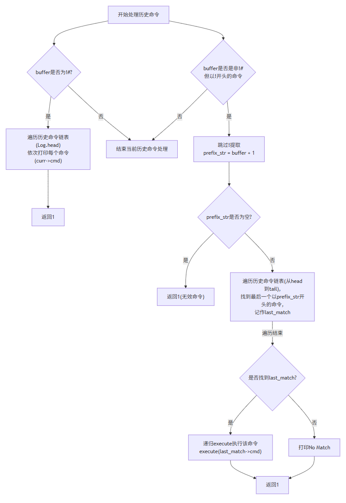

<slide class="bg-black-blue aligncenter" image="https://source.unsplash.com/C1HhAQrbykQ/ .dark">
:::{.content-left}
#### 分割命令

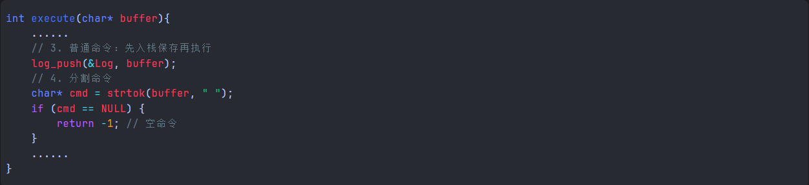

<slide class="bg-black-blue aligncenter" image="https://source.unsplash.com/C1HhAQrbykQ/ .dark">
:::{.content-center}
#### 内置命令

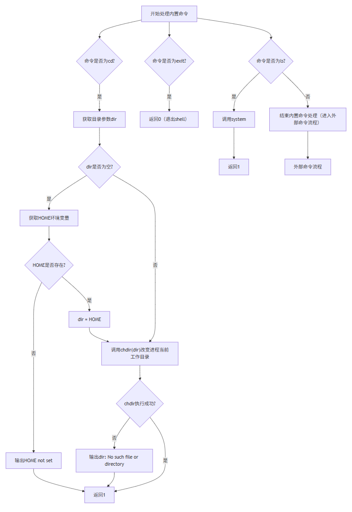

<slide class="bg-black-blue aligncenter" image="https://source.unsplash.com/C1HhAQrbykQ/ .dark">

:::{.content-center}

#### 执行外部命令
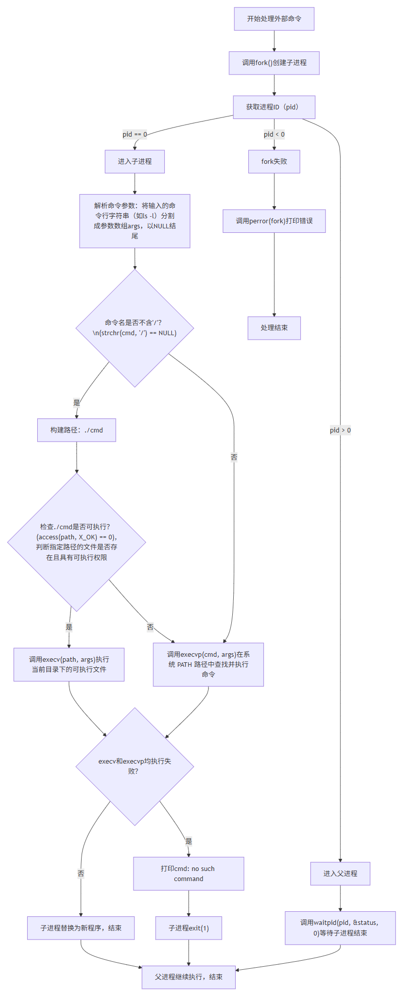

<slide class="bg-black-blue aligncenter" image="https://source.unsplash.com/C1HhAQrbykQ/ .dark">
:::{.content-center}
## 实现高速路网 {.text-landing.text-shadow}
<slide class="bg-black-blue aligncenter" image="https://source.unsplash.com/C1HhAQrbykQ/ .dark">
:::{.content-center}
## 总流程图

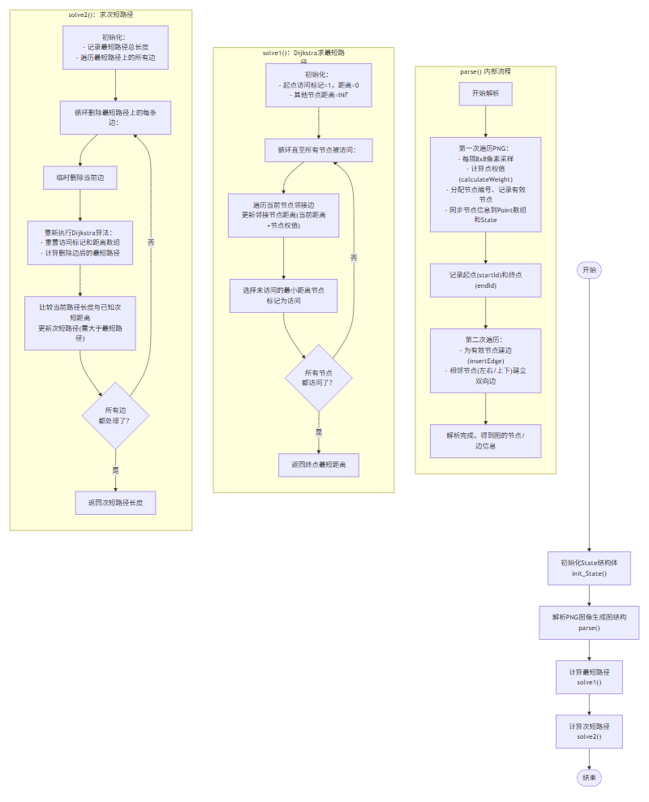

<slide class="bg-black-blue aligncenter" image="https://source.unsplash.com/C1HhAQrbykQ/ .dark">
:::{.content-left}
## 分工
- ### 建图parse：高安程
- ### 最短路径solve1：邢玥茗
- ### 次短路径solve2：王天朔
- ### 调试：祁盛

<slide class="bg-black-blue aligncenter" image="https://source.unsplash.com/C1HhAQrbykQ/ .dark">
:::{.content-center}
## 优化设计流程

<slide class="bg-black-blue aligncenter" image="https://source.unsplash.com/C1HhAQrbykQ/ .dark">
:::{.content-center}
## 第一版建图
---
- 每个有效节点通过`nodeCnt++`获得唯一的线性编号，不采用二维坐标
- 同行相邻的节点编号相邻
- 相邻行相邻的节点以第一行的列数（`maxLine`）作为跨行连接的 “基准”，推算编号（通过`nodeCnt - maxLine`等计算上一行节点）
- **建边逻辑复杂，不直观**：奇偶行的差异化规则增加了代码理解和维护成本，且需严格保证节点编号与行、列的对应关系（否则易出现连接错误）。

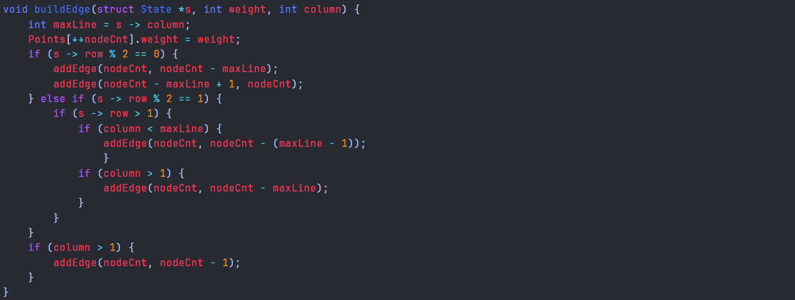

<slide class="bg-black-blue aligncenter" image="https://source.unsplash.com/C1HhAQrbykQ/ .dark">
:::{.content-center}

## 第二版建图

---
- 将节点编号改为二维的方式

- 优点：**依照空间邻接关系来建模更为合理，更贴近真实场景** ：
	- 边的建立不仅考虑同一行的左右相邻，还通过 “奇偶行差异化” 处理上下行的交错邻接，模拟了二维空间中节点的自然邻接关系（类似网格或蜂窝结构）
	
	  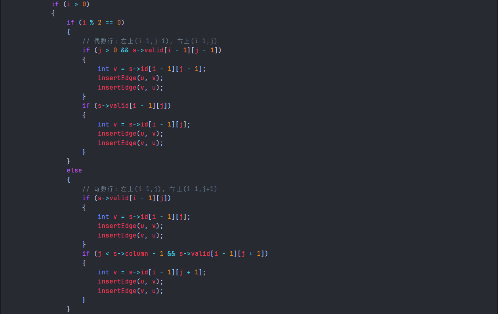

<slide class="bg-black-blue aligncenter" image="https://source.unsplash.com/C1HhAQrbykQ/ .dark">
:::{.content-center}

## Solve1流程图

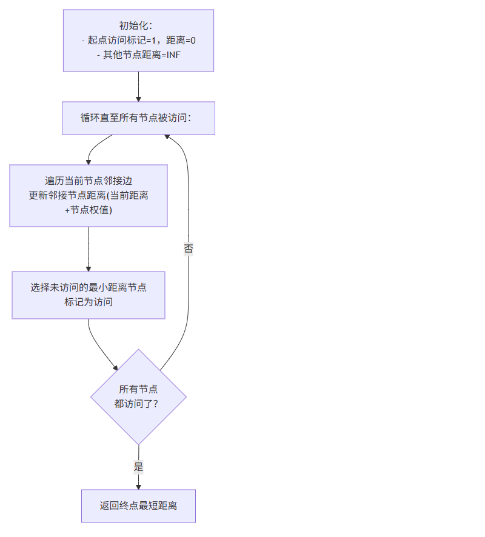

<slide class="bg-black-blue aligncenter" image="https://source.unsplash.com/C1HhAQrbykQ/ .dark">
:::{.content-center}
## Solve1代码
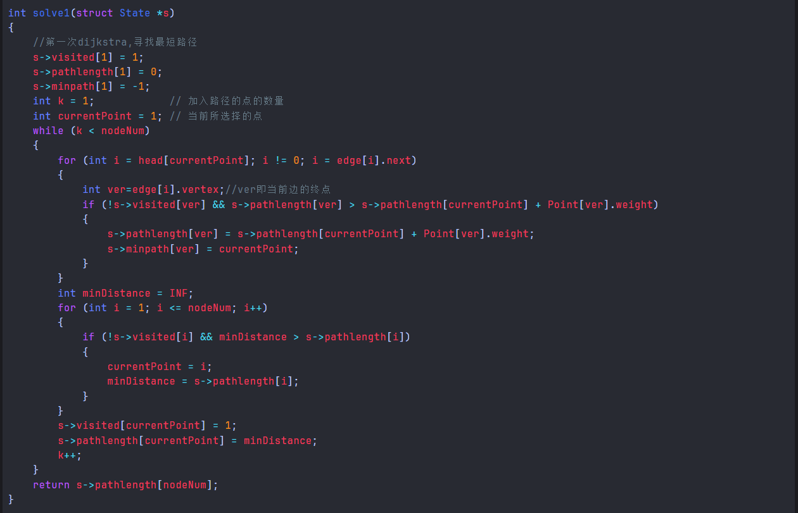
<slide class="bg-black-blue aligncenter" image="https://source.unsplash.com/C1HhAQrbykQ/ .dark">
:::{.content-center}

## Solve2流程图

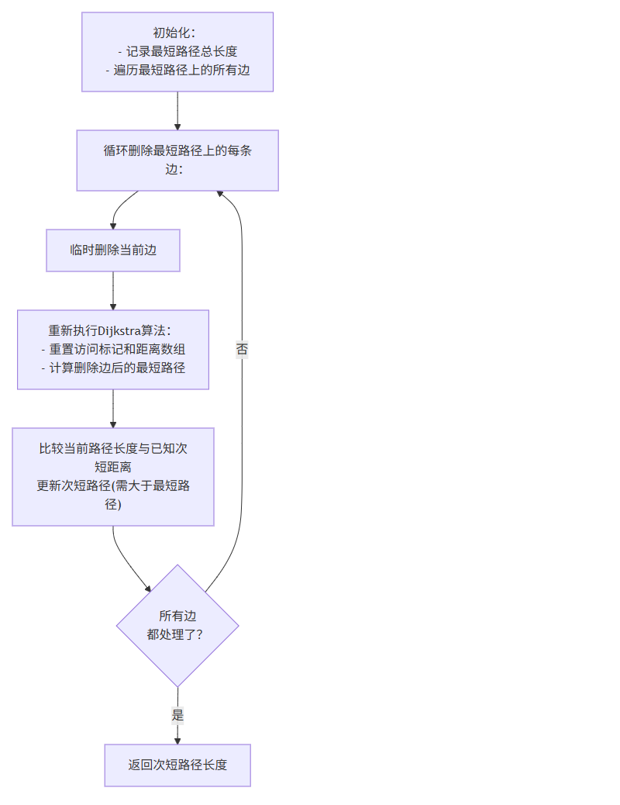

<slide class="bg-black-blue aligncenter" image="https://source.unsplash.com/C1HhAQrbykQ/ .dark">
:::{.content-center}
## Solve2代码
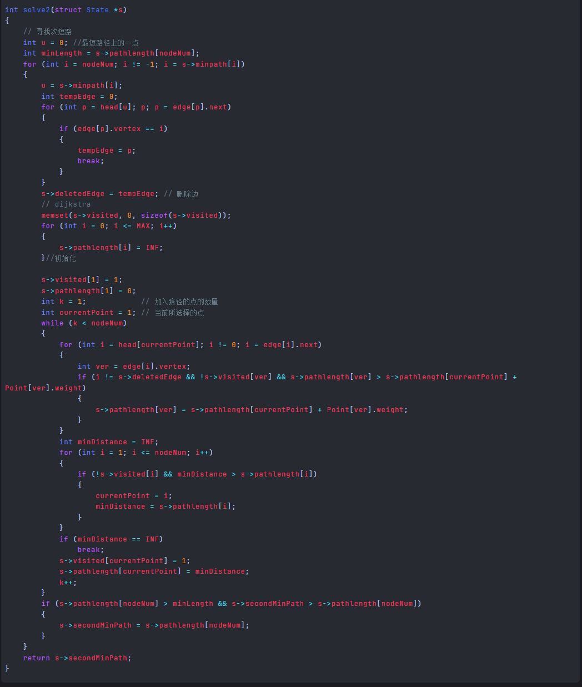

<slide class="bg-black-blue aligncenter" image="https://source.unsplash.com/C1HhAQrbykQ/ .dark">
:::{.content-center}

## 黑白棋 {.text-landing.text-shadow}

<slide class="bg-black-blue aligncenter" image="https://source.unsplash.com/C1HhAQrbykQ/ .dark">
:::{.content-center}
## 任务内容

- ##### 写出自己的AI与对方AI对战。
- ##### 在经典黑白棋规则的基础之上，增加一个额外信息：棋子分数。对于棋盘上的每个格子，均有一个 1 至 9 之间的分数，格子上的分数属于格子上的棋子所属人。

<slide class="bg-black-blue aligncenter" image="https://source.unsplash.com/C1HhAQrbykQ/ .dark">
:::{.content-left}

## 任务细节

---

- ### 任务一

  地图中所有格子除了中间四个以外均为1。

- ### 任务二

  地图中所有格子除了中间四个**四个角**以外的分数均为1。

- ### 任务三

  地图中所有格子除了**中间四个以及最外层一圈**以外的格子分数均为 1。

- ### 任务四

  地图上的格子分数无额外限制。
  

<slide class="bg-black-blue aligncenter" image="https://source.unsplash.com/C1HhAQrbykQ/ .dark">
:::{.content-center}

## 具体实现 {.text-landing.text-shadow}

<slide class="bg-black-blue aligncenter" image="https://source.unsplash.com/C1HhAQrbykQ/ .dark">
:::{.content-center}

## 代码内函数基本介绍

<slide class="bg-black-blue aligncenter" image="https://source.unsplash.com/C1HhAQrbykQ/ .dark">
:::{.content-left}

### 一、初始化与工具函数
1. `init(struct Player *player)`
  
    - 功能：每局游戏开始时初始化 AI，调用`init_opponent`初始化对手走法优先级矩阵。
2. `init_opponent(struct Player *player)`
  
    - 功能：初始化对手相关参数，记录初始棋子位置到`start_point`数组。
3. `copy_player(struct Player* dest, const struct Player* src)`
  
    - 功能：深拷贝玩家状态（棋盘、分数、行列数等），用于假设性走棋时保存原状态。
4. `free_player_mat(struct Player* player)`
  
    - 功能：释放玩家棋盘矩阵的动态内存，避免内存泄漏。
5. `in(struct Player *player,int x,int y)`
  
    - 功能：判断坐标`(x,y)`是否在棋盘范围内。

<slide class="bg-black-blue aligncenter" image="https://source.unsplash.com/C1HhAQrbykQ/ .dark">
:::{.content-left}

### 二、合法性检查函数
1. `is_valid(int row_cnt,int col_cnt,char mat[][30], int posx, int posy,char my_sign,char his_sign)`
  
    - 功能：检查在指定棋盘`mat`中，`(posx,posy)`位置是否为`my_sign`的合法落子（能翻转`his_sign`的棋子）。
2. `is_avalid(struct Player *player, int posx, int posy)`
  
    - 功能：检查当前玩家（己方，`'O'`）在`(posx,posy)`的落子是否合法（封装`is_valid`，固定己方为`'O'`，对手为`'o'`）。
3. `find_all_legal_moves(struct Player* player, struct Point legal_moves[])`
  
    - 功能：查找当前玩家的所有合法落子，存储到`legal_moves`数组，返回合法走法数量。
4. `count_legal_moves(struct Player* player)`
  
    - 功能：统计当前玩家的合法落子数量（行动力评估的基础）。

<slide class="bg-black-blue aligncenter" image="https://source.unsplash.com/C1HhAQrbykQ/ .dark">
:::{.content-left}

### 三、走法预测与选择函数
1. `judge_corner(struct Player *player)`
  
    - 功能：检查四个角落是否为己方合法落子，优先选择角落位置。
2. `judge_side(struct Player *player)`
  
    - 功能：检查棋盘边缘（非角落）的合法落子，优先选择能巩固边缘控制的位置。
3. `calc_grade(struct Player *player)`
  
    - 功能：计算每个合法落子的 “分数”（基于翻转对手棋子的数量和位置权重），用于排序。
4. `partition(int s,int t)`、`QuickSort(int s,int t)`
  
    - 功能：快速排序算法，用于对合法落子按`calc_grade`计算的分数排序。
5. `select_point(struct Player *player)`
  
    - 功能：从排序后的合法落子中选择最优位置，考虑稳定性、角落保护等策略。
6. `predict_opponent_move(struct Player *player)`
  
    - 功能：预测对手的最佳落子位置（模拟对手视角的走法选择）。

<slide class="bg-black-blue aligncenter" image="https://source.unsplash.com/C1HhAQrbykQ/ .dark">
:::{.content-left}

### 四、棋盘状态处理函数
1. `switch_perspective(struct Player* player)`
  
    - 功能：切换棋盘视角（交换己方`'O'`和对手`'o'`的棋子，交换分数），用于模拟对手回合。
2. `make_hypothetical_move(struct Player* player, struct Point move)`
  
    - 功能：在指定玩家的棋盘上执行假设性落子，并翻转所有被夹住的对手棋子（用于搜索时模拟走棋）。
3. `judge_stable(struct Player *player)`
  
    - 功能：判断棋盘上的 “稳定棋子”（不会被对手翻转的棋子），标记到`map`数组中。
4. `exclude_position(struct Player *player,int x,int y)`
  
    - 功能：判断`(x,y)`是否为需要排除的危险位置（可能导致对手抢占角落）。
5. `get_late_game_threshold(struct Player *player)`
  
    - 功能：根据棋盘大小计算 “残局阈值”（棋子总数达到该值时，评估函数更侧重棋子数量）。

<slide class="bg-black-blue aligncenter" image="https://source.unsplash.com/C1HhAQrbykQ/ .dark">
:::{.content-left}

### 五、评估与搜索函数

1. `evaluate_state(struct Player *player)`
  
    - 功能：评估当前棋盘状态的分数，综合考虑角落控制、行动力、棋子数量（残局）三个因素，加权计算。
2. `compare_moves(const void *a, const void *b)`
  
    - 功能：用于`qsort`的比较函数，按对手优先级降序排序合法走法，优化 Alpha-Beta 剪枝效率。
3. `alpha_beta(struct Player *player, int depth, int alpha, int beta, bool is_maximizing_player)`
  
    - 功能：Alpha-Beta 剪枝搜索核心，递归评估各走法的优劣，返回最佳评估值（MAX 层最大化分数，MIN 层最小化分数）。
4. `place(struct Player *player)`
  
    - 功能：AI 的核心落子决策函数，调用`alpha_beta`搜索选择最优落子位置，处理特殊情况（无合法走法或唯一走法）。

<slide class="bg-black-blue aligncenter" image="https://source.unsplash.com/C1HhAQrbykQ/ .dark">
:::{.content-center}

## 关键函数详细讲解  {.text-landing.text-shadow}

<slide class="bg-black-blue aligncenter" image="https://source.unsplash.com/C1HhAQrbykQ/ .dark">
:::{.content-center}
### 1. `evaluate_state(struct Player *player)`
- 评估当前棋盘状态的分数，综合考虑角落控制、行动力、棋子数量三个因素
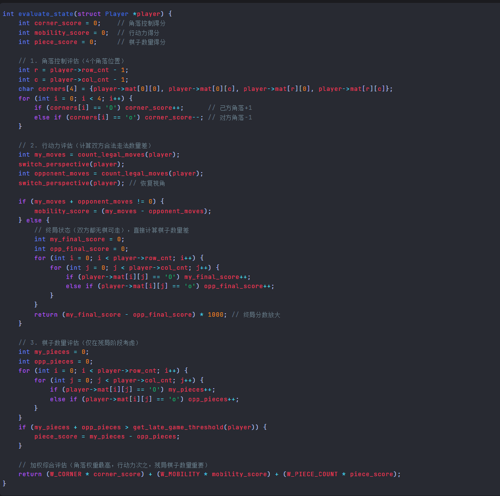

<slide class="bg-black-blue aligncenter" image="https://source.unsplash.com/C1HhAQrbykQ/ .dark">
:::{.content-left}

### **关键点**：
- ##### **角落控制**：角落位置（如`(0,0)`）对游戏胜负影响极大，得分为 ±1。
- ##### **行动力**：当前可走步数多的一方更具优势，得分为`我方步数 - 对方步数`。
- ##### **残局策略**：当棋子总数超过阈值（如 64 格棋盘为 37）时，转为重视棋子数量。

<slide class="bg-black-blue aligncenter" image="https://source.unsplash.com/C1HhAQrbykQ/ .dark">
:::{.content-center}

##### 2. `alpha_beta(struct Player *player, int depth, int alpha, int beta, bool is_maximizing_player)`

- Alpha-Beta 剪枝算法的核心实现，递归搜索最优走法，减少不必要的计算

  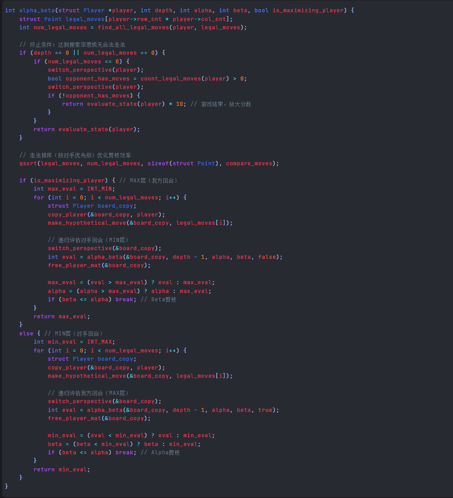

<slide class="bg-black-blue aligncenter" image="https://source.unsplash.com/C1HhAQrbykQ/ .dark">
:::{.content-left}
### **关键点**：

- ##### **剪枝优化**：通过 Alpha（MAX 下限）和 Beta（MIN 上限）的比较，提前放弃不可能的分支
- ##### **递归搜索**：交替模拟我方（MAX 层）和对手（MIN 层）的最优决策
- ##### **走法排序**：使用`compare_moves`对走法预排序，提高剪枝效率

<slide class="bg-black-blue aligncenter" image="https://source.unsplash.com/C1HhAQrbykQ/ .dark">
:::{.content-center}
### 3. `place(struct Player *player)`
- AI 的主决策函数，调用 Alpha-Beta 搜索选择最优落子位置

  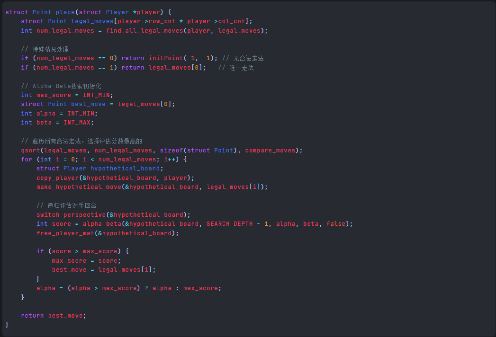
<slide class="bg-black-blue aligncenter" image="https://source.unsplash.com/C1HhAQrbykQ/ .dark">
:::{.content-left}
### **关键点**：
- ##### **特殊情况处理**：直接返回唯一走法或无合法走法。
- ##### **搜索深度**：通过`SEARCH_DEPTH`（默认 4）控制递归层数，平衡计算效率和决策质量。
- ###### **走法评估**：对每个合法走法生成假设棋盘，调用 Alpha-Beta 评估分数。

<slide class="bg-black-blue aligncenter" image="https://source.unsplash.com/C1HhAQrbykQ/ .dark">
:::{.content-center}
### 4. `make_hypothetical_move(struct Player* player, struct Point move)`
- 在假设棋盘上执行落子，并翻转被夹住的对手棋子

  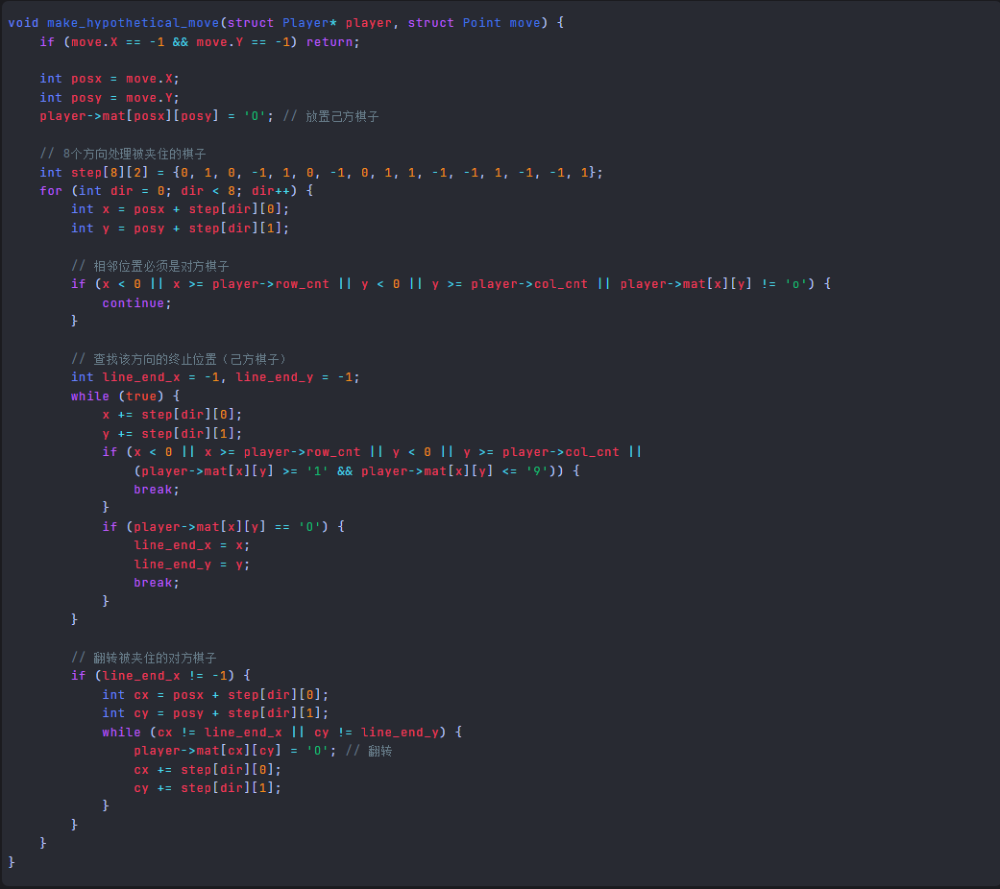
  

<slide class="bg-black-blue aligncenter" image="https://source.unsplash.com/C1HhAQrbykQ/ .dark">
:::{.content-left}
### **关键点**：
- ##### **方向检测**：检查 8 个方向上是否存在被夹住的对手棋子链。
- ##### **棋子翻转**：从落子点出发，找到链的两端（己方棋子），将中间的对手棋子全部翻转。

<slide class="bg-black-blue aligncenter" image="https://source.unsplash.com/C1HhAQrbykQ/ .dark">
:::{.content-center}
##### 5. `is_valid(int row_cnt,int col_cnt,char mat[][30], int posx, int posy,char my_sign,char his_sign)`
- 检查在指定位置落子是否合法（可翻转对手棋子)

  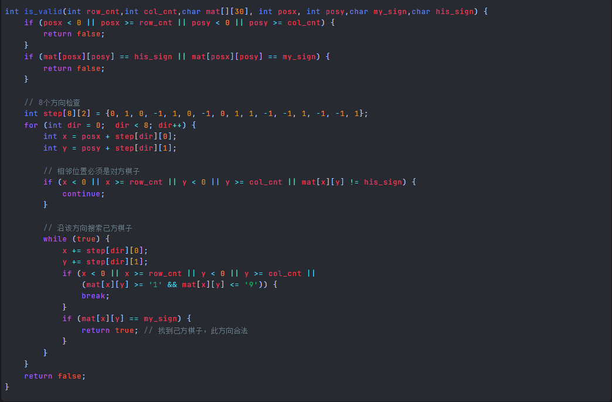

<slide class="bg-black-blue aligncenter" image="https://source.unsplash.com/C1HhAQrbykQ/ .dark">
:::{.content-left}

### **关键点**：

- ##### **边界检查**：确保落子位置在棋盘内且为空。
- ##### **方向合法性**：只要有一个方向能形成 “对手棋子链” 且链的末端是己方棋子，则合法。

<slide class="bg-black-blue aligncenter" image="https://source.unsplash.com/C1HhAQrbykQ/ .dark">
:::{.content-left}

### 总结
这些函数共同构成了一个完整的黑白棋 AI 决策系统：
- **评估函数**（`evaluate_state`）提供局面价值判断，指导搜索方向。
- **Alpha-Beta 剪枝**（`alpha_beta`）通过递归搜索找到最优走法，优化计算效率。
- **走法执行**（`make_hypothetical_move`）和**合法性检查**（`is_valid`）确保 AI 的每一步都符合游戏规则。
- **主决策函数**（`place`）整合所有逻辑，输出最终落子位置。

<slide class="bg-black-blue aligncenter" image="https://source.unsplash.com/C1HhAQrbykQ/ .dark">
:::{.content-center}
## 蒜头抢分大作战

<slide class="bg-black-blue aligncenter" image="https://source.unsplash.com/C1HhAQrbykQ/ .dark">
:::{.content-left}

### 游戏简介

在一个 `n x m` 的地图上，两只**蒜头**AI 对抗，争夺分数。地图上还有两名**破坏者**（鬼），它们会干扰并试图消灭蒜头。游戏目标是在回合结束时获得比对手更高的分数。

### 核心规则

#### 角色与地图

* 蒜头 共 2 只，玩家控制其中 1 只。
* 破坏者 共 2 只，AI 控制。其移动有随机性，但会优先追击距离更近的蒜头。
* 地图
  * 墙 无法进入。
  * 地面 可以移动，地面上可能有 **普通星** 或 **超级星**。

<slide class="bg-black-blue aligncenter" image="https://source.unsplash.com/C1HhAQrbykQ/ .dark">
:::{.content-left}

### 任务与策略

#### 任务一：静态环境

* **场景** 10×10 地图，对手 AI 和破坏者均**不动**。
* **目标** > 500 分。
* **核心策略**
  由于所有单位静止，此任务可简化为寻路问题。只需规划一条**最短路径**，吃掉地图上所有星星，同时避开固定的对手和墙壁即可。

### 任务二：动态环境

* **场景** 10×10 地图，对手 AI 不动，但有 1-2 名**移动的破坏者**。

* **目标** > 500 分 (单鬼) / > 400 分 (双鬼)。

* **核心策略**
  高分的关键在于**利用强化状态吃掉破坏者**。

* **基本思路**

  1. **生存优先** 普通状态下，计算与破坏者的距离，保持安全距离，避免被捕。
  2. **寻找超级星** 将吃**超级星**作为首要目标，以进入可以反击的强化状态。
  3. **主动出击** 进入强化状态后，立刻改变策略，**主动追击**破坏者来获取高额分数。
  4. **机会主义** 在确保安全或追击破坏者的途中，顺路收集普通星星。

<slide class="bg-black-blue aligncenter" image="https://source.unsplash.com/C1HhAQrbykQ/ .dark">
:::{.content-center}

## 任务三&四&PVP思路

<slide class="bg-black-blue aligncenter" image="https://source.unsplash.com/C1HhAQrbykQ/ .dark">
:::{.content-left}
1. 13 * 15 有迷宫地图，双鬼不动，ai动
	实验一下就会发现ai很傻，根本不可能吃到超级星（即甚至不用考虑躲避对手），也不可能依赖吃对手大幅度提升自己的分数，所以采取自力更生策略

策略：专注 “逐行吃豆”，**高效清理所有豆子**，完全不考虑与幽灵或对手的互动：
- 遍历顺序：从地图最下行开始，逐行向上清理（`row从row_cnt-1递减到0`）。
- 每行处理：统计当前行所有剩余豆子（`'o'`或`'O'`），对每个豆子，计算从玩家当前位置向四个方向移动后到该豆子的最短距离，选择距离最小的方向。
- 优先级：只要当前行有豆子，就优先吃本行，直到本行豆子吃完再处理上一行；所有豆子吃完后原地不动。
<slide class="bg-black-blue aligncenter" image="https://source.unsplash.com/C1HhAQrbykQ/ .dark">
:::{.content-left}
2. 10 * 10 全豆地图，双鬼和随机ai都动
**玩家处于 “普通状态”（需规避幽灵，优先吃豆）**  
此时按 “超级豆`'O'`优先于普通豆`'o'`” 的逻辑决策，通过**评分机制**平衡 “安全性” 和 “吃豆效率”：
- 若存在超级豆（`nowstar > 0`）：  
    对四个方向的潜在移动计算评分`tjudge`
    `tjudge = (30 - nowghost) * (tghost - nowghost) + 27 * (nowstar - tstar)`
	    nowghost为当前位置距离幽灵的最短距离，tghost为尝试移动后距离幽灵的最短距离
		nowstar为当前位置距离超级星的最短距离，tstar为尝试移动后距离超级星的最短距离
    - 第一项：鼓励 “移动后与幽灵的距离变大”（`tghost - nowghost`为正，更安全），权重与当前幽灵距离负相关（幽灵越近，越重视安全性）。
    - 第二项：鼓励 “移动后与超级豆的距离变小”（`nowstar - tstar`为正，更快吃到），权重固定为 27。
    - 规避危险：若移动后与幽灵距离为 1（即时危险），评分为负无穷，直接排除。

- **若没有超级豆（优先普通豆）**：  
    逻辑类似，但评分公式调整为：  
    `tjudge = (100 - nowghost) * (tghost - nowghost) + 97 * (nowlstar - tlstar)`
    - 普通豆的权重（97）远高于超级豆场景，更侧重高效吃普通豆；
    - 对幽灵距离的敏感度降低（系数从 30 变为 100），允许在更安全的情况下优先吃豆。
    
<slide class="bg-black-blue aligncenter" image="https://source.unsplash.com/C1HhAQrbykQ/ .dark">
:::{.content-left}
## 任务四
鬼和ai都动，且ai有一定判断能力
这个四个人的思路就很不同了

<slide class="bg-black-blue aligncenter" image="https://source.unsplash.com/C1HhAQrbykQ/ .dark">
:::{.content-left}
### gac：
### qs：延续任务二的堵门流（刷分方法）
### wts：

<slide class="bg-black-blue aligncenter" image="https://source.unsplash.com/C1HhAQrbykQ/ .dark">
:::{.content-LEFT}
#### 一、死胡同判断的优化：精准识别高风险地形
通过`is_dead_end`函数判断：
1. **基于 “有效出口数量” 的判断逻辑**  
    函数通过统计目标位置（x,y）的**4 个正交方向（上下左右）的有效出口**（非墙且在地图内）数量，若有效出口≤1，则判定为死胡同。
2. **与风险评估联动**  
    死胡同判断结果（`is_dead_end`）会直接影响星星的综合评分：在`calculate_star_score`中，若星星位于死胡同且幽灵距离＜安全阈值（`DEAD_END_SAFE_DIST=5`），会额外扣除 300 分（惩罚高风险死胡同）。
    - 区分 “安全死胡同”（幽灵距离≥5）和 “危险死胡同”（幽灵距离＜5），避免盲目进入高风险狭窄区域，平衡 “吃豆收益” 与 “逃生难度”。

<slide class="bg-black-blue aligncenter" image="https://source.unsplash.com/C1HhAQrbykQ/ .dark">
:::{.content-left}
#### 二、安全距离阈值的优化：分层适配场景风险
安全距离阈值是判断 “威胁程度” 的核心参数，代码通过**分层设置阈值**，适配不同场景的风险特性，优化点如下：
1. **基础安全距离（`SAFE_DISTANCE=1`）**  
    定义 “与幽灵 / 强化对手的最小安全距离”：曼哈顿距离＞1（即不相邻）。若距离≤1，判定为 “即时危险”（例如幽灵在隔壁格子，下一步可能被攻击）。
2. **危险预警距离（`DANGER_DISTANCE=3`）**  
    当幽灵距离≤3 时，触发 “主动躲避逻辑”（调用`find_best_move_away_ghost`）。    
3. **死胡同专属安全距离（`DEAD_END_SAFE_DIST=5`）**  
    针对死胡同（逃生路径少）设置更远的安全距离：只有当幽灵距离≥5 时，才认为死胡同内的豆子 “相对安全”。这个5相当于设置了更远的安全距离补偿其 “路径单一” 的风险，避免在狭窄通道中被幽灵前后夹夹击
<slide class="bg-black-blue aligncenter" image="https://source.unsplash.com/C1HhAQrbykQ/ .dark">
:::{.content-LEFT}
#### 三、幽灵预测的优化：动态趋势预判，减少决策滞后
幽灵的移动具有一定连续性，代码通过`predict_ghost_pos`函数预测其下一步位置，优化点如下：
1. **基于 “历史移动趋势” 的预测逻辑**  
    利用幽灵 “沿直线移动” 的特性（多数 AI 控制的幽灵倾向于保持方向）。通过记录幽灵的 “上一位置” 和 “当前位置”，预测下一位置为 “当前位置 + 方向向量”；若预测位置是墙或越界，则保持当前位置。
2. **适配攻击与躲避决策**  
    预测位置用于后续的 “攻击目标评估”（`AttackTarget`）：计算与预测位置的距离、性价比（奖励 / 距离），优先追击 “易击杀（距离近、奖励高）” 的幽灵。

<slide class="bg-black-blue aligncenter" image="https://source.unsplash.com/C1HhAQrbykQ/ .dark">
:::{.content-LEFT}

### xym：
#### 移动方向选择：基于加权评分的精细化决策
在 “接近目标” 或 “远离威胁” 时，通过**加权评分机制**量化每个方向的优劣，选择最优解：
1. **接近目标（`find_best_move_approach`）**  
    遍历四个方向（+ 不动），选择 “移动后到目标距离最短” 的方向，确保高效接近目标（幽灵、豆子等）。
2. **远离幽灵（`find_best_move_away_ghost`）**  
    对每个候选方向评分，核心权重包括：
    - 规避 3 步内的幽灵（权重`W1=10000`，距离越近惩罚越大）；
    - 不进入另一个幽灵的 3 步内（权重`W2=5000`）；
    - 靠近超级豆（权重`W4=2000`，距离越近加分越多）；
    - 优先吃普通豆（权重`W5=1000`）；
    - 拉长与两个幽灵的距离（权重`W6=2`，用距离平方和放大长距离优势）；
    - **规避墙边和普通胡同（减少被堵风险）。**
3. **远离对手（`find_best_move_away_opponent`）**  
    逻辑类似远离幽灵，但更侧重 “拉大与对手的距离”（用距离平方放大优势）和规避普通胡同。
<slide class="bg-black-blue aligncenter" image="https://source.unsplash.com/C1HhAQrbykQ/ .dark">
:::{.content-LEFT}
#### 胡同环境的特殊处理
胡同作为高风险狭窄区域，单独设计了逃生策略：
- **胡同内逃生（`escape_in_alley`）**：当处于胡同中且被幽灵逼近时，仅沿胡同的两个可通行方向移动，选择 “到幽灵距离最远” 的方向（避免在狭长通道中被前后夹击）。
- **超级豆胡同动态更新**：当超级豆被吃掉后，通过`update_alley_after_eat_superstar`将 “超级星胡同” 降级为普通胡同，避免后续错误决策（无需再向该胡同移动）。
<slide class="bg-black-blue aligncenter" image="https://source.unsplash.com/C1HhAQrbykQ/ .dark">
:::{.content-center}
## PVP
<slide class="bg-black-blue aligncenter" image="https://source.unsplash.com/C1HhAQrbykQ/ .dark">
:::{.content-LEFT}
### 一、策略的动态适应性：基于地图规模的分层调整
**根据地图大小（面积）动态切换策略参数**，将地图分为四类: 
- **小地图（面积≤120）**：激进策略。
	高攻击权重（5.0）、低抢占阈值（1）、低开阔度奖励（15.0），倾向于主动竞争豆子和攻击。
- **中地图（120 < 面积≤250）**：
	均衡策略。中等攻击权重（2.0）、中等抢占阈值（0）、中等开阔度奖励（20.0），平衡得分与安全。
- **大地图（250 < 面积≤400）**：
	保守策略。低攻击权重（0.8）、负抢占阈值（-5）、高开阔度奖励（30.0），更注重安全和规避风险。
- **超大地图（面积 > 400）**：
	生存优先策略。极低攻击权重（0.2）、极低抢占阈值（-10）、极高开阔度奖励（50.0），核心目标是存活，优先选择安全区域。
	
<slide class="bg-black-blue aligncenter" image="https://source.unsplash.com/C1HhAQrbykQ/ .dark">
:::{.content-LEFT}
### 二、核心决策逻辑：状态优先
---
#### 1. 强化状态下（自身处于可攻击状态）：优先攻击
强化状态（可能是吃超级豆后获得，有时间限制）下，行为核心是**利用攻击窗口期获取收益**：
- 攻击目标包括两类：
    - 幽灵：若与幽灵的距离小于强化剩余时间（可追上并击杀），优先攻击（得分高）。
    - 对手：若对手未处于强化状态，且距离小于强化剩余时间（可攻击），则作为备选目标。
- 攻击目标的优先级通过 “距离倒数 × 攻击权重” 评估：距离越近、攻击权重越高（小地图），优先级越高。
 
<slide class="bg-black-blue aligncenter" image="https://source.unsplash.com/C1HhAQrbykQ/ .dark">
:::{.content-LEFT}
#### 2. 非强化状态下：优先收集豆子（兼顾安全）
非强化状态下，核心是**安全收集豆子得分**，豆子评估综合多维度因素：
- **超级豆优先**：优先选择 “自身距离≤对手距离 + 抢占阈值” 的超级豆（确保能抢到手），超级豆可触发强化状态，是扭转局势的关键。
- **普通豆评估**：对普通豆计算综合得分，公式为：  
    `得分 = -距离惩罚（距离越近越好） - 幽灵风险惩罚（幽灵越近风险越高） + 开阔度奖励（出口越多越安全）`  
    其中，幽灵风险根据距离分级（≤1 格风险 + 100，≤3 格风险 + 60），避免靠近危险区域；开阔度（出口数量）影响安全，高开阔度位置更易躲避，在大图中权重更高。
- **规避死胡同**：死胡同仅在距离幽灵足够远时才考虑，避免被困。

<slide class="bg-black-blue aligncenter" image="https://source.unsplash.com/C1HhAQrbykQ/ .dark">
:::{.content-LEFT}
#### 3. 无明确目标或危险时：优先安全移动
当没有合适的攻击目标或豆子（如所有豆子风险过高），则通过`find_safe_adjacent`寻找最安全的相邻位置：
- 安全评估标准：到幽灵 / 对手的距离（越远越安全）+ 开阔度（越高越安全），确保不进入危险区域（幽灵 / 对手的安全距离内）。

<slide class="bg-black-blue aligncenter" image="https://source.unsplash.com/C1HhAQrbykQ/ .dark">
:::{.content-LEFT}

### 三、风险控制机制
策略中嵌入多重安全保障，确保生存底线：
- **路径安全性检查**：所有移动前通过`is_valid_move`验证，避免进入幽灵 / 对手的安全距离内（非强化状态）。
- **BFS 路径规划**：通过 BFS 计算最短路径，确保移动高效且安全（只走可达且无即时危险的路线）
- **紧急避险**：若目标路径不安全，立即切换到`find_safe_adjacent`返回的安全位置，避免死亡。
- **初始安全点**：初始化时计算 “离两个幽灵总距离最远” 的位置，作为潜在避难所。
<slide class="bg-black-blue aligncenter" image="https://source.unsplash.com/C1HhAQrbykQ/ .dark">
:::{.content-center}
# 提问 
<slide class="bg-black-blue aligncenter" image="https://source.unsplash.com/C1HhAQrbykQ/ .dark">
:::{.content-center}
## 感谢各位助教老师的工作！辛苦啦！
