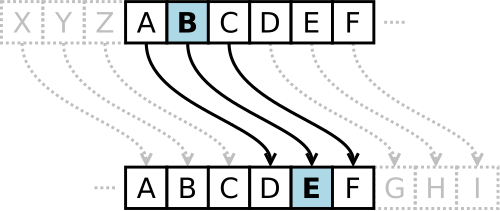

<style>
@import url('https://cdn.jsdelivr.net/npm/lxgw-wenkai-webfont@1.1.0/style.css');
.reveal .slides *:not(.katex):not(.katex *):not(mjx-container):not(mjx-container *) {
font-family: 'LXGW WenKai', sans-serif !important;
}

.button-container {
display: flex;
align-items: center;
justify-content: center;
gap: 20px;
position: relative;
width: 100%; 
}

.button {
display: flex;
align-items: center;
justify-content: center;  
text-decoration: none;
border: 1px solid #ddd;
padding: 0; 
border-radius: 50%;  
width: 85px; 
height: 85px; 
transition: transform 0.3s ease, border-color 0.3s ease;  
cursor: pointer;
overflow: hidden;
}

.button img {
width: 100%;  
height: 100%;  
object-fit: cover;  
border-radius: 50%;  
}

.button:hover {
transform: scale(1.1);
border-color: rgba(0, 123, 255, 0.2);
box-shadow: 0 2px 10px rgba(0, 123, 255, 0.2); 
}

.button-container .button-text {
position: absolute; 
top: 50%;
left: 100%;  
transform: translateY(-50%); 
opacity: 0;  
visibility: hidden;  
transition: opacity 0.3s ease, visibility 0.3s ease;
white-space: nowrap; 
font-size: 20px;
}
</style>

<!-- .slide: data-background="crypto-lec1/background.webp" -->

<br>
<br>
<br>
<center><h5 style="font-size: 55px; text-align: center;">密码学初探</h5></center>
<br>
<center><h1 style="font-size: 30px; text-align: center;">2025.9.7</h1></center>
<br>
<center><div class="button-container" >
</button>
<span>DAWN</span>
</div></center>

<!-- s -->
<!-- .slide: data-background="Crypto/background.webp" -->

## 欢迎来到密码学的世界

<div class="fragment" style="margin-top: 40px">

**密码学(Cryptography)** 

</div>

<div class="fragment" style="margin-top: 40px">

- 使用数学系统对数据进行处理

</div>


<div class="fragment" style="margin-top: 40px">

- 实现数据保密性与可信性

</div>

<div class="fragment" style="margin-top: 40px">

- 「精准而优雅」

</div>


<!-- s -->
<!-- .slide: data-background="Crypto/background.webp" -->

## 它存在哪些应用价值与场景？

<div class="fragment" style="margin-top: 40px">

- 许多数据需要得到保密 -- 信息的**机密性**
	- 9 · 3阅兵中的兵器参数与指标
	- 网络上我们的个人详细信息

</div>

<div class="fragment" style="margin-top: 40px">

- 许多数据不能被篡改 -- 信息的**完整性**
	- 通信部队的情报交流内容
	- 银行卡，微信的余额
	- 萝卜快跑(武汉无人驾驶汽车)传感器收到的各项参数

</div>

<div class="fragment" style="margin-top: 40px">

```markdown
只要有数据在网络中存储，传输，就需要对其进行加密，防止它被篡改
```

</div>

<!-- v -->
<!-- .slide: data-background="Crypto/background.webp" -->

## 它有哪些分类？

<div class="fragment" style="margin-top: 40px">

- 从时间上看，可以分为古典密码学与现代密码学
	
</div>


<div class="fragment" style="margin-top: 40px">

- 从密码学系统构成上看，可以分为对称密码与非对称密码
	- 古典密码是简单的对称替换密码
	- 现代密码学主要为具备公私钥的非对称密码系统
	
</div>

<div class="fragment" style="margin-top: 40px">

```markdown
不论分类如何，使用严谨的数学体系进行运算和推理，是密码学不变的特征
```

</div>

<!-- s -->
<!-- .slide: data-background="Crypto/background.webp" -->

## 我该如何学习密码学？

<div class="fragment" style="margin-top: 40px">

- 了解常见密码学系统的工作原理
	
</div>

<div class="fragment" style="margin-top: 40px">

- 学习过程中补充相关的数学基本知识
	- 譬如同余、整除理论
	
</div>


<div class="fragment" style="margin-top: 40px">

- 做题，并在做题的过程中结合AI学习常见的脚本语言，(python&sage)

</div>


<div class="fragment" style="margin-top: 40px">

- 逐渐培养从题目加密代码中抽象出密码学情景的能力

</div>

<div class="fragment" style="margin-top: 40px">

```
有点类似做数学题，但更讲究合理应用前人的成果与严谨的推导，对技巧要求没那么高
```

</div>


<!-- s -->
<!-- .slide: data-background="Crypto/background.webp" -->

## 密码学术语
<div class="fragment" style="margin-top: 40px">

- 有意义的信息称为**明文(Plaintext)**, 它是我们想保密的信息，在CTF中往往就是flag
- 以某种方法(运算，代换)来隐藏它的过程称为**加密(Encryption)**
- 加密后得到的无法知晓原本信息的消息被称为**密文(Ciphertext)** 往往在题目中给出
- 把密文恢复为明文的过程称为**解密(Decryption)**

</div>
<br>
<div class="fragment" style="margin-top: 40px">

- 一个密码学系统中的加密解密算法统称为**密码算法(Cryptography Algorithm)**

</div>
<br>
<div class="fragment" style="margin-top: 40px">

- **密钥** : 除开明文/密文外，用于加密/解密时的必要信息

</div>

<!-- s -->
<!-- .slide: data-background="Crypto/background.webp" -->

## 密码学示例之凯撒密码


<div class="fragment" style="margin-top: 40px">

- 是一种单表替换加密技术，明文中的所有字母都在字母表上向后（或向前）按照一个固定数目进行偏移后被替换成密文
	

</div>

<div class="fragment" style="margin-top: 40px">

- 示例(偏移为3)
```
明文字母表：ABCDEFGHIJKLMNOPQRSTUVWXYZ
密文字母表：DEFGHIJKLMNOPQRSTUVWXYZABC
```

</div>

<!-- s -->
<!-- .slide: data-background="Crypto/background.webp" -->


<br>
<br>
<br>
<center><h5 style="font-size: 55px; text-align: center;">Q&A</h5></center>

<!-- s -->
<!-- .slide: data-background="Crypto/background.webp" -->


<br>
<br>
<br>
<center><h5 style="font-size: 55px; text-align: center;">感谢倾听！</h5></center>