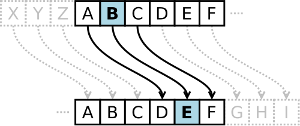
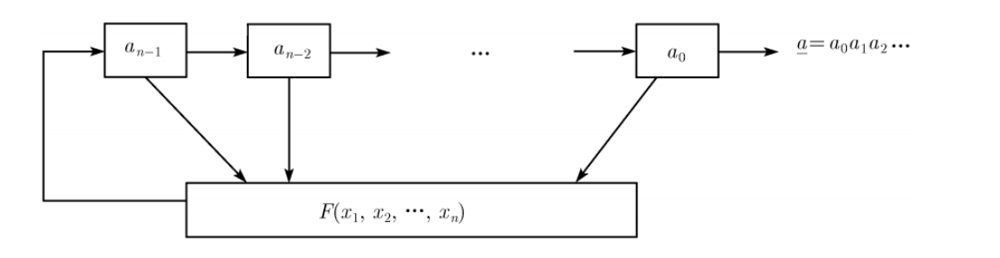
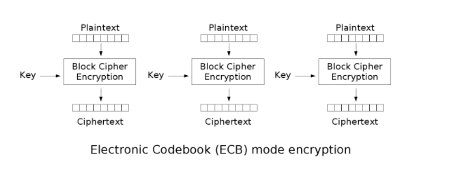
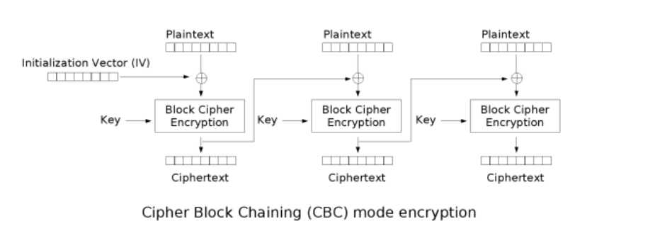

<style>
@import url('https://cdn.jsdelivr.net/npm/lxgw-wenkai-webfont@1.1.0/style.css');

.reveal .slides *:not(.katex):not(.katex *):not(mjx-container):not(mjx-container *) {
    font-family: 'LXGW WenKai', sans-serif !important;
}


    .button-container {
    display: flex;
    align-items: center;
    justify-content: center;
    gap: 20px;
    position: relative;
    width: 100%; 
}

        .button {
            display: flex;
            align-items: center;
            justify-content: center;  
            text-decoration: none;
            border: 1px solid #ddd;
            padding: 0; 
            border-radius: 50%;  
            width: 85px; 
            height: 85px; 
            transition: transform 0.3s ease, border-color 0.3s ease;  
            cursor: pointer;
            overflow: hidden;
        }
    
        .button img {
            width: 100%;  
            height: 100%;  
            object-fit: cover;  
            border-radius: 50%;  
        }
    
        .button:hover {
            transform: scale(1.1);
            border-color: rgba(0, 123, 255, 0.2);
            box-shadow: 0 2px 10px rgba(0, 123, 255, 0.2); 
        }
    
        .button-container .button-text {
            position: absolute; 
            top: 50%;
            left: 100%;  
            transform: translateY(-50%); 
            opacity: 0;  
            visibility: hidden;  
            transition: opacity 0.3s ease, visibility 0.3s ease;
            white-space: nowrap; 
            font-size: 20px;
        }
    </style>
<!-- .slide: data-background="crypto-lec1/background.webp" -->

<br>
<br>
<br>
<center><h5 style="font-size: 55px; text-align: center;">密码学基础</h5></center>
<br>
<center><h1 style="font-size: 30px; text-align: center;">2025.8</h1></center>
<br>
<center><div class="button-container" >
<button class="button" onclick="toggleContent()" title = "Click to see more about me">
  
</button>
<span>Zijeff</span>
</div></center>

<!-- s -->
<!-- .slide: data-background="Crypto/background.webp" -->

## 本堂课的内容
<div class="fragment" style="margin-top: 40px">

- 导论与古典密码:单表替换、多表替换及历史背景

</div>
<div class="fragment" style="margin-top: 40px">

- 现代密码学数学基础:同余、数论基本定理

</div>
<div class="fragment" style="margin-top: 40px">

- 对称加密:流密码、块密码

</div>
<div class="fragment" style="margin-top: 40px">

- 非对称加密与数字签名:RSA、ECC、DSA

</div>
<div class="fragment" style="margin-top: 40px">

- 实战:CTF例题

</div>

<!-- v -->
<!-- .slide: data-background="Crypto/background.webp" -->
<div class="fragment" style="margin-top: 40px">

## 什么是密码学
- 研究编制密码和破译密码的技术科学
  - 设计加解密算法
  - 破解加解密算法

</div>

<div class="fragment" style="margin-top: 40px">

## 为什么需要密码学？
- 信息的存储需要保密
	- 账号密码，个人身份证号，机密方案
- 信息的传输不能被篡改 
	- 军事战略方针 在线支付的金额
	</div>

<!-- v -->
<!-- .slide: data-background="Crypto/background.webp" -->

## 密码学术语
<div class="fragment" style="margin-top: 40px">

- 有意义的信息称为**明文(Plaintext)**, 它是我们想保密的信息，在CTF中往往就是flag
- 以某种方法(运算，代换)来隐藏它的过程称为**加密(Encryption)**
- 加密后得到的无法知晓原本信息的消息被称为**密文(Ciphertext)** 往往在题目中给出
- 把密文恢复为明文的过程称为**解密(Decryption)**

</div>
<br>
<div class="fragment" style="margin-top: 40px">

- 一个密码学系统中的加密解密算法统称为**密码算法(Cryptography Algorithm)**

</div>
<br>
<div class="fragment" style="margin-top: 40px">

- **密钥** : 除开明文/密文外，用于加密/解密时的必要信息

</div>
<!-- v -->
<!-- .slide: data-background="Crypto/background.webp" -->

## 古典密码

<div class="fragment" style="margin-top: 40px">

- 类别主要包含置换密码、移项式密码
	- 置换密码又包含单表置换(凯撒密码)， 多表置换(维吉尼亚密码)
	- 移项式密码包含部分栅栏密码

</div>

<div class="fragment" style="margin-top: 40px">

- 由于明文空间往往是可读的英文字句，易被破解，常见方法如下
	- 词频分析
	- 暴力破解
	

</div>

<!-- v -->
<!-- .slide: data-background="Crypto/background.webp" -->

## 凯撒密码


<div class="fragment" style="margin-top: 40px">

- 是一种单表替换加密技术，明文中的所有字母都在字母表上向后（或向前）按照一个固定数目进行偏移后被替换成密文
	

</div>

<div class="fragment" style="margin-top: 40px">

- 示例(偏移为3)
```
明文字母表：ABCDEFGHIJKLMNOPQRSTUVWXYZ
密文字母表：DEFGHIJKLMNOPQRSTUVWXYZABC
```

</div>

<!-- v -->
<!-- .slide: data-background="Crypto/background.webp" -->

## 维吉尼亚密码

<div class="fragment" style="margin-top: 10px">

- 是使用一系列凯撒密码组成密码字母表的加密算法，属于多表替换密码的一种简单形式	

</div>
<div class="fragment" style="margin-top: 40px">

- 在一个凯撒密码中，字母表中的每一字母都会作一定的偏移，例如偏移量为3时，A就转换为了D、B转换为了E……而维吉尼亚密码则是由一些偏移量不同的凯撒密码组成。
- 为了生成密码，需要使用表格法。这一表格包括了26行字母表，每一行都由前一行向左偏移一位得到。具体使用哪一行字母表进行编译是基于密钥进行的，在过程中会不断地变换

</div>
<!-- v -->
<!-- .slide: data-background="Crypto/background.webp" -->
## 示例
<div class="fragment" style="margin-top: 10px">

- 假设明文为
```
ATTACKATDAWN
```

</div>
<div class="fragment" style="margin-top: 10px">

- 选择某一关键词并重复而得到密钥，如关键词为 `LEMON` 时，密钥为
```
LEMONLEMONLE
```

</div>

<div class="fragment" style="margin-top: 40px">

- 对于明文的第一个字母A，对应密钥的第一个字母L，于是使用表格中L行字母表进行加密，得到密文第一个字母L。类似地，明文第二个字母为T，在表格中使用对应的E行进行加密，得到密文第二个字母X。以此类推，可以得到

```text
明文：ATTACKATDAWN
密钥：LEMONLEMONLE
密文：LXFOPVEFRNHR
```

</div>

<!-- v -->
<!-- .slide: data-background="Crypto/background.webp" -->
## 示例

<div class="fragment" style="margin-top: 10px">

- 解密的过程则与加密相反。例如：根据密钥第一个字母L所对应的L行字母表，发现密文第一个字母L位于A列，因而明文第一个字母为A。密钥第二个字母E对应E行字母表，而密文第二个字母X位于此行T列，因而明文第二个字母为T。以此类推便可得到明文

</div>

<div class="fragment" style="margin-top: 40px">

可以写成如下同余式(C,P,K分别代表密文,明文,密钥)
- 加密
$$
C_i\equiv P_i+K_i\mod26
$$
- 解密
$$
P_i\equiv C_i-K_i\mod26
$$

</div>

<!-- v -->
<!-- .slide: data-background="Crypto/background.webp" -->
## 破译
<div class="fragment" style="margin-top: 10px">

- 所有的替换密码的破译都是以**字母频率**为基础的，比如在英语中字频最高的字母是 `e` ，因而单表替换后出现频率最高的字母我们可以认为是`e` 加密后的结果

</div>


<div class="fragment" style="margin-top: 10px">

- 但是维吉尼亚密码的破译不能直接进行分析，因为字母的偏移量是随着密钥动态变化的，但是密钥的循环使用也使得我们能进行弱化版的词频分析

</div>


<div class="fragment" style="margin-top: 20px">

```text
明文：ATTACKATDAWN
密钥：LEMONLEMONLE
密文：LXFOPVEFRNHR
```
这里我们第1 6 11的明文使用的偏移量都是`L` 所以说我们可以先猜测密钥的长度(大致不会超过30字符)，随后以密钥长度为步长划分出同一偏移量的密文，来进行词频分析
</div>

<div class="fragment" style="margin-top: 20px">

附上两个分析词频比较常用的工具网站

[Vigenere Solver | guballa.de](https://www.guballa.de/vigenere-solver)

[quipqiup - cryptoquip and cryptogram solver](https://www.quipqiup.com/)

</div>

<!-- v -->
<!-- .slide: data-background="Crypto/background.webp" -->
## 移项式密码
<div class="fragment" style="margin-top: 20px">

- 加密变换使得信息元素只有位置变化而内容不变

</div>

<div class="fragment" style="margin-top: 20px">

- 栅栏密码
	- 把明文分割成k行，然后重新拼接，这里k即为加密的密钥

</div>


<div class="fragment" style="margin-top: 20px">

- 例如`k=3 P = crypto basic`
	- 加密过程如下，首先按明文顺序分割成3行
```
(1) cp s
(2) rtbi
(3) yoac
```
重新按行拼接得到密文C= cp srtbiyoac
</div>


<!-- s -->
<!-- .slide: data-background="Crypto/background.webp" -->

## 现代密码学数学基础

<div class="fragment" style="margin-top: 20px">

### 整除

- 定义:设$ab\in Z$,$a\neq0$,若$\exists k\in Z$，使得$b=ak$,则我们称$a$整除$b$，记为$a\mid b$,有如下三条性质
  - $\forall a\in Z$有$1\mid a$,若$a\neq0$,$a\mid a$且$a\mid 0$
  - 若$a \mid b$且$b \mid c $,则$ a \mid c$
  - 若$a \mid b$且$ a \mid c $则$ \forall s,t \in Z, a \mid (sb + tc)$

</div>

<!-- v -->
<!-- .slide: data-background="Crypto/background.webp" -->
## 现代密码学数学基础

<div class="fragment" style="margin-top: 20px">

### 素数与互素

- 素数的定义:设$p\in\mathbb{Z}$，若$p$的因子只有$\pm1$及$\pm p$，则称$p$为素数。
- 互素的定理（relatively prime）的定义: 对于整数$a, b$，若$\gcd(a,b)=1$，则称$a$与$b$互素
	- （$\gcd$：最大公约数，Greatest Common Divisor）
		- 示例
		- $a=3$, $b=5$，$\gcd(a,b)=1$
		- $a=3$, $b=4$，$\gcd(a,b)=1$
		- $a=4$, $b=9$，$\gcd(a,b)=1$

</div>

<!-- v -->
<!-- .slide: data-background="Crypto/background.webp" -->

## 现代密码学数学基础

<div class="fragment" style="margin-top: 20px">

- 素数相关的定理: 任一整数$a$（$a>0$）都能唯一分解成以下形式：
	- $a = p_1 \cdot p_2 \cdot p_3 \cdot \dots \cdot p_t$其中$p_1, p_2, p_3, \dots, p_t$是素数。

</div>

<div class="fragment" style="margin-top: 40px">

### 最大公约数（gcd）
- 定义: 最大公约数是指能够整除多个整数的最大正整数。
- gcd相关的定理: 
	- 设$a,b\in\mathbb{Z}$，且$a,b$中至少有一个不等于$0$，令$d=\gcd(a,b)$，则存在整数$x,y$使得下式成立：
		- $a \times x + b \times y = d$
		- 特别地，当$a,b$互素时（即$\gcd(a,b)=1$），则存在整数$x,y$使得：$a \times x + b \times y = 1$。(裴蜀定理)

</div>

<!-- v -->
<!-- .slide: data-background="Crypto/background.webp" -->

## 现代密码学数学基础

<div class="fragment" style="margin-top: 20px">

### 模（mod）运算和同余

- 同余的定义: 设 $a,b,n \in \mathbb{Z}$，且 $n \neq 0$
- 若 $a - b$ 是 $n$ 的倍数（即 $\exists k \in \mathbb{Z}$ 使得 $a = b + n \cdot k$），则称 $a$ 与$b$ 对于模 $n$ 同余（$a$ is congruent to $b$ modulo $n$），记作：$a \equiv b \pmod{n}$
	- 记为$a \bmod n = b \bmod n$
	- 示例
		- $1 \equiv 4 \pmod{3}$（因为 $1 - 4 = -3$ 是 $3$ 的倍数）
		- $5 \equiv 8 \pmod{3}$（因为 $5 - 8 = -3$ 是 $3$ 的倍数）

</div>

<!-- v -->
<!-- .slide: data-background="Crypto/background.webp" -->

## 现代密码学数学基础

<div class="fragment" style="margin-top: 20px">

### 同余相关的性质

- $m \mid (a-b) \Leftrightarrow a \equiv b \bmod m$
- $a \equiv b \bmod m, c \equiv d \bmod m \rightarrow a \pm c \equiv b \pm d \bmod m$
- $a \equiv b \bmod m, c \equiv d \bmod m \rightarrow a \cdot c \equiv b \cdot d \bmod m$
- $a \equiv b \bmod m \rightarrow a \cdot c \equiv b \cdot c \bmod m$
- $a \cdot c \equiv b \cdot c \bmod m, \text{gcd}(c, m) = 1 \rightarrow a \equiv b \bmod m$
- $a \equiv b \bmod m, n \in \mathbb{N} \rightarrow a^n \equiv b^n \bmod m$

</div>

<!-- v -->
<!-- .slide: data-background="Crypto/background.webp" -->

## 现代密码学数学基础

<div class="fragment" style="margin-top: 20px">

### 逆元相关的性质

加法模逆元:
- 定义: 设 $a, b, n \in \mathbb{Z}$ 且 $n \neq 0$,若$a + b \equiv 0 \pmod{n}$，则称 $a$ 是 $b$ 的加法模 $n$ 逆元，$b$ 也是 $a$ 的加法模 $n$ 逆元

乘法模逆元:
- 定义: 设 $a, b, n \in \mathbb{Z}$ 且 $a \times b \equiv 1 \pmod{n}$，则称 $a$ 是 $b$ 的乘法模 $n$ 逆元，记作 $b^{-1}$(即 $a \equiv b^{-1} \pmod{n}$)

</div>


<!-- v -->
<!-- .slide: data-background="Crypto/background.webp" -->

## 现代密码学数学基础

<div class="fragment" style="margin-top: 20px">

### 费马小定理
- 定义:  若 $p$ 是一个素数，且整数 $a$ 不是 $p$ 的倍数($gcd(a,p)=1$),则
	- $a^{p-1} \equiv 1 \pmod{p}$
	- 或者 对于任意整数 $a$ 和素数 $p$，都有:$a^p \equiv a \pmod{p}$

</div>

<!-- v -->
<!-- .slide: data-background="Crypto/background.webp" -->

## 现代密码学数学基础

<div class="fragment" style="margin-top: 20px">

### 欧拉定理 (Euler's Theorem)

- 定义: 费马小定理的推广，将适用范围从素数模 $p$ 扩展到了任意正整数模 $n$
<br>
<br>
### 欧拉函数 (Euler's Function)	

- 定义: 小于等于 $n$ 的正整数中与 $n$ 互素（$\gcd(x,n)=1$）的数的个数
- 公式
	- $p$为素数，则 $$\phi(n) = n \prod_{p \mid n} \left(1 - \frac{1}{p}\right)$$

</div>

<!-- v -->
<!-- .slide: data-background="Crypto/background.webp" -->

## 现代密码学数学基础

<div class="fragment" style="margin-top: 20px">

### 欧拉函数
- 性质:  
	- 若 $p$ 为素数，则 $\phi(p) = p - 1$
	- 若 $p$ 为素数，则 $\phi(p^k) = p^k - p^{k-1}$
        - 若 $\gcd(a,b)=1$，则 $\phi(ab) = \phi(a) \cdot \phi(b)$ (积性)

#### 欧拉定理
- 若整数 $a$ 与正整数 $n$ 互素（即 $\gcd(a,n)=1$），则有：
$$
a^{\phi(n)} \equiv 1 \pmod{n}
$$
</div>

<!-- v -->
<!-- .slide: data-background="Crypto/background.webp" -->
## 现代密码学数学基础

<div class="fragment" style="margin-top: 20px">

#### 中国剩余定理 (Chinese Remainder Theorem)
- 定义: 关于一元线性同余方程组有解以及解的计算
- 内容: 假设整数 $m_1, m_2, \dots, m_r$ 两两互素，则对于任意整数 $a_1, a_2, \dots, a_r$，以下同余方程组有唯一解
$$
\begin{cases}
x \equiv a_1 \pmod{m_1}\\\\ x \equiv a_2 \pmod{m_2}\\\\ \vdots \\\\ x \equiv a_r \pmod{m_r}
\end{cases}
$$

</div>

<!-- v -->
<!-- .slide: data-background="Crypto/background.webp" -->
## 现代密码学数学基础

<div class="fragment" style="margin-top: 20px">

#### 中国剩余定理 (Chinese Remainder Theorem)
- **求解公式**：
	- 令 $M = \prod\limits_{i=1}^r m_i = m_1 m_2 \cdots m_r$
	- 令 $M_i = \frac{M}{m_i}$
	- 令 $M_i^{-1}$ 为 $M_i$ 模 $m_i$ 的乘法逆元（即 $M_i \cdot M_i^{-1} \equiv 1 \pmod{m_i}$）
- 方程组在模 $M$ 下的唯一解为：
$$
x \equiv \sum_{i=1}^r a_i M_i M_i^{-1} \pmod{M}
$$
</div>

<!-- s -->
<!-- .slide: data-background="Crypto/background.webp" -->
## 对称加密

<div class="fragment" style="margin-top: 20px">

#### 流密码

</div>

<div class="fragment" style="margin-top: 20px">

核心思想: 利用密钥$k$生成一个伪随机的数据流
$$
x_nx_{n-1}x_{n-2}\cdots x_2x_{1}x_{0}
$$
利用这个数据流来和我们的明文进行处理(譬如异或等)
</div>


<div class="fragment" style="margin-top: 40px">

我们保证保密性的核心就是密钥流的随机性

以异或处理为例子，假设我们的密文是
$$
c_nc_{n-1}c_{n-2}\cdots c_2c_{1}c_{0}
$$

</div>


<div class="fragment" style="margin-top: 30px">

对于任何明文流$m$，我们都能找到一个符合条件的密钥流，即
$$
x_i=c_i\oplus m_i
$$
</div>

<!-- v -->
<!-- .slide: data-background="Crypto/background.webp" -->
## 对称加密

<div class="fragment" style="margin-top: 30px">

综上，流密码可以分成以下流程
- 密钥派生: 使用伪随机生成器(PRG)由密钥生成长密钥流
- 流式处理: 将密钥流和明文流进行处理(譬如异或)
</div>

<div class="fragment" style="margin-top: 30px">

PRG具备如下特征
- 长周期
- 高线性复杂度, 不易被数学推导来预测(LCG)
- 统计性能良好, 不易被统计预测信息
- 足够的“混乱”、“扩散” , 是其"随机性"的体现
</div>
<div class="fragment" style="margin-top: 30px">

流密码具备如下特征
- 明文长度无明确要求
- 加密解密的操作是对称的，关键在于恢复密钥流
</div>

<!-- v -->
<!-- .slide: data-background="Crypto/background.webp" -->
## 对称加密
<div class="fragment" style="margin-top: 30px">

#### 常见的PRG及其漏洞
- 伪随机数生成器(PRNG)
- 线性同余生成器(LCG)
- 反馈移位寄存器(FSR)
</div>


<!-- v -->
<!-- .slide: data-background="Crypto/background.webp" -->
## 对称加密
<div class="fragment" style="margin-top: 30px">

#### 伪随机数生成器(PRNG)
- 本节课的PRNG特指使用不安全的`random`库函数引入的随机数
	- 这类random随机数的原理是梅森旋转([MT19937](https://github.com/guoql666/pyrandcracker))
	- 连续获取 624 * 32 = 19,968  字节的连续随机生成数据即可恢复随机数生成器状态
```python
import random
from randcrack import RandCrack
 
rc = RandCrack()
 
for i in range(624):
    rc.submit(random.getrandbits(64))#修改为提交了624个64位数
 
print(random.getrandbits(64))#利用random库获取一个64位的随机数
print(rc.predict_getrandbits(64))#利用randcrack获取的随机数
```
</div>

<!-- v -->
<!-- .slide: data-background="Crypto/background.webp" -->
## 对称加密
<div class="fragment" style="margin-top: 30px">

#### 线性同余生成器(LCG)
- 递推生成式大致如下
$$
X_{n+1}\equiv aX_{n} + c \mod n
$$
- 其具备很强的线性相关性，故容易被数学推导来破解，往往只需要几组连续的输出$X_i$即可

</div>

<!-- v -->
<!-- .slide: data-background="Crypto/background.webp" -->
## 对称加密
<div class="fragment" style="margin-top: 30px">

#### 反馈移位寄存器(FSR)



- 新生成的信息与当前的状态相关
- 即

$$
a_n=F(a_0,a_1,a_2,\cdots, a_{n-2}, a_{n-1})
$$
</div>

<!-- v -->
<!-- .slide: data-background="Crypto/background.webp" -->
## 对称加密
<div class="fragment" style="margin-top: 30px">

#### 线反馈移位寄存器(LFSR)

- $F$是线性函数，即
$$
a_n=\sum^{n-1}_{i=0}c_ia_i
$$
- 可以考虑使用Berlekamp-Massey算法来破解LFSR，需要连续$2n$组输出，即
$$
\begin{cases}
S_1=(a_1,\cdots,a_n)\\\\ \vdots \\\\ S_n=(a_n,\cdots,a_{2n})
\end{cases}
$$
即可构造出一个满秩方程组求解$c_i$
</div>

<!-- s -->
<!-- .slide: data-background="Crypto/background.webp" -->
## 对称加密
<div class="fragment" style="margin-top: 30px">

#### 块密码

</div>

<div class="fragment" style="margin-top: 30px">

核心思想: 对明文进行分块加密，不同块之间存在一定相关性

同样的 密钥需要拓展到同等长度的块

保密性在于密钥拓展到块的混淆以及块之间处理关系的复杂性

具体体现在算法的**混淆**、**扩散**思想
</div>

<!-- v -->
<!-- .slide: data-background="Crypto/background.webp" -->
## 对称加密

<div class="fragment" style="margin-top: 30px">

类似前文，我们可以总结块密码的流程

-  密钥派生
-  信息分块
-  块网络处理

</div>
<div class="fragment" style="margin-top: 30px">

<div class="fragment" style="margin-top: 30px">

Crypto方向的CTF赛题中常见的块密码是AES,DES

考点集中在对于AES不同加密方式 CBC EBC等的加密方式的理解与利用

</div>

<!-- v -->
<!-- .slide: data-background="Crypto/background.webp" -->
## 对称加密
<div class="fragment" style="margin-top: 30px">


- ECB模式 

对明文分块，和密钥派生的密钥块按个进行异或，块与块之间独立
</div>

<!-- v -->
<!-- .slide: data-background="Crypto/background.webp" -->
## 对称加密
<div class="fragment" style="margin-top: 30px">



- CBC模式 

有初始向量`iv` 
对明文分块，初始向量iv先与第一个明文块异或，随后参与块加密过程，块与块之间的加密高度相关
</div>


<!-- v -->
<!-- .slide: data-background="Crypto/background.webp" -->
## 对称加密
<div class="fragment" style="margin-top: 30px">

AES代码示例
```python
from Crypto.Cipher import AES
from random import Random
key = b"KeyMustBe16Bytes"
# 创建AES加密器实例，密钥为key，ECB模式无需初始向量
cipher1 = AES.new(key, AES_MODE_ECB) 
# 创建AES加密器实例，密钥为key，CBC模式需要初始向量iv
iv = b"ivShouldBe16Byte"
cipher2 = AES.new(key, AES_MODE_CBC, iv) 
msg = b"This_is_a_message"
# 分别用cipher1,cipher2对明文msg进行加密，注意要把msg填充到16的倍数长，使得能够分块
ciphertext1 = cipher1.encrypt(pad(msg,16))
ciphertext2 = cipher2.encrypt(pad(msg,16))
# 解密
message1 = cipher1.decrypt(ciphertext1)
message2 = cipher2.decrypt(ciphertext2)
```

</div>

<!-- s -->
<!-- .slide: data-background="Crypto/background.webp" -->
## 非对称加密

<div class="fragment" style="margin-top: 30px">

对称加密的特点在于加密与解密需要的信息，算法都是高度对称的

</div>

<div class="fragment" style="margin-top: 30px">

- 流密码加密解密都只需要相同密钥派生的密钥流，异或的过程是可逆的

</div>


<div class="fragment" style="margin-top: 30px">

- 块密码加密解密所需要的密钥，初始向量(AES_CBC)也是对称的，实际上如果分析块密码的Feistel&SPN网络，能发现加密与解密的流程实际上也是一致的，只需要交换消息块和密钥块的位置即可
- 但python中已经集成了常见块密码加密解密的函数，我们不必在这个上面消耗过多精力

</div>

<!-- v -->
<!-- .slide: data-background="Crypto/background.webp" -->
## 非对称加密

<div class="fragment" style="margin-top: 30px">

而非对称加密的特点就是加密解密所需要的信息是不对称的，算法也往往存在差异

</div>

<div class="fragment" style="margin-top: 30px">

- 非对称加密系统往往建立在著名的 **陷门问题(DropDoorProblem)** 上
- 譬如对大合数进行质因数分解，求解离散对数，格中困难问题等

</div>


<div class="fragment" style="margin-top: 40px">

本堂课的重心集中于前两者，即
- 由大数分解构建的RSA加密体系
- 由求解离散对数构建的DSA公钥签名体系

</div>

<!-- v -->
<!-- .slide: data-background="Crypto/background.webp" -->
## 非对称加密

<div class="fragment" style="margin-top: 30px">

### RSA

我们都知道 $3\times5=15$,也不难得出$15=3\times5$


</div>

<div class="fragment" style="margin-top: 30px">

那$437$呢，慢慢估计一下也能得出$437=23\times19$

</div>


<div class="fragment" style="margin-top: 30px">

那如果是
```python
589261209884777246133335457710764586826592931591902765490687
```

</div>

<div class="fragment" style="margin-top: 30px">

结果是
```python
p =  799454375762760889821613484011
q =  737079222716821134845662387517
n = p*q =  589261209884777246133335457710764586826592931591902765490687
```
</div>

<!-- v -->
<!-- .slide: data-background="Crypto/background.webp" -->
## 非对称加密

<div class="fragment" style="margin-top: 30px">

由此可见，对于两个大素数的积的质因数分解，非常困难，但是正向计算是简单的

- 这种正着容易反过来难的问题，我们就称为**陷门**

</div>

<div class="fragment" style="margin-top: 30px">

它们并非无解，而是以当下的算力与算法，我们无法接受解出它们所消耗的时间成本

</div>


<div class="fragment" style="margin-top: 10px">

上一个问题的代码

```python
from Crypto.Util.number import *
p = getPrime(100)
q = getPrime(100)
print("p = ", p)
print("q = ", q)
print("n = ", p * q)
```
考虑开根枚举的方法 大致$2^{50}$的运算复杂度，即使是最强大的CPU使用numpy库进行优化，也得跑1.45天，这显然没法接受，更何况实际选用的素数往往是1024位
</div>


<!-- v -->
<!-- .slide: data-background="Crypto/background.webp" -->
## 非对称加密

<div class="fragment" style="margin-top: 40px">

我们已经论证了RSA的核心安全保障，接下来我们来过一遍RSA的加密解密流程
- 我们称加密方为Alice,解密方为Bob,攻击者为X

</div>
<div class="fragment" style="margin-top: 40px">

#### 加密

Alice选取两个大素数$p$ $q$ ,计算它们的积$n=p\times q$

选取一个数$e$，一般保证它是一个素数，常用65537

</div>
<div class="fragment" style="margin-top: 40px">

计算$n$的欧拉函数$\phi(n)=(p-1)\times(q-1)$

计算$e$对$\phi$的模逆元$d$，即
$$
ed\equiv1 \mod \phi
$$
</div>

<!-- v -->
<!-- .slide: data-background="Crypto/background.webp" -->
## 非对称加密

<div class="fragment" style="margin-top: 40px">

选取要加密的信息$m$，保证$m\le n$计算
$$
c\equiv m^e \mod n
$$

</div>
<div class="fragment" style="margin-top: 40px">

加密完成，公钥为$(e,n)$ 私钥为$(d,n)$,密文为$c$

Alice只需提前将私钥给Bob保密即可，公钥与密文可以公开给网络
</div>

<!-- v -->
<!-- .slide: data-background="Crypto/background.webp" -->
## 非对称加密
<div class="fragment" style="margin-top: 40px">

#### 解密

Bob对于已有的密文$c$，计算
$$
c^d\equiv m\mod n
$$
即可恢复明文
</div>


<!-- v -->
<!-- .slide: data-background="Crypto/background.webp" -->
## 非对称加密

<div class="fragment" style="margin-top: 40px">

#### 证明

由
$$
ed\equiv1\mod \phi
$$
可得
$$
ed=1+k\phi
$$
</div>

<div class="fragment" style="margin-top: 40px">

那么
$$
c^d\equiv m^{ed} \equiv m^{1+k\phi} \equiv m\times (m^{\phi})^{k} \mod n
$$
</div>

<!-- v -->
<!-- .slide: data-background="Crypto/background.webp" -->
## 非对称加密

<div class="fragment" style="margin-top: 40px">

#### 证明

由欧拉定理，
因为$n$是两个大素数的积，故$gcd(m,n)=1$,那么
$$
m^{\phi}\equiv1\mod n
$$

</div>

<div class="fragment" style="margin-top: 40px">

所以
$$
m^d\equiv m\times (m^{\phi})^{k} \equiv m\mod n
$$
证毕
</div>

<!-- v -->
<!-- .slide: data-background="Crypto/background.webp" -->
## 非对称加密

<div class="fragment" style="margin-top: 40px">

### 安全性

攻击者$X$只有公钥$(e,n)$,它的目标是从
$$
c\equiv m^e \mod n
$$
中恢复出$m$,如果他想避免在模$n$域下对$c$开$e$次方根，就得计算欧拉函数$\phi(n)$
</div>

<div class="fragment" style="margin-top: 40px">

但是由于$n$分解的困难性，他无法计算$\phi(n)$，也就保证了RSA系统的安全性

</div>

<!-- v -->
<!-- .slide: data-background="Crypto/background.webp" -->
## 非对称加密

<div class="fragment" style="margin-top: 40px">

### 漏洞

CTF赛题中与RSA相关的漏洞往往体现在以下三个方面
- 分解$n$相关
- 私钥$d$泄露相关
- 参数选取不当


</div>

<!-- v -->
<!-- .slide: data-background="Crypto/background.webp" -->
## 非对称加密

<div class="fragment" style="margin-top: 40px">

### 分解$n$相关漏洞

常见的有如下类别
- $p$,$q$信息泄露
	- $p$高低位泄露，或者相关运算代数式泄露
- 两对公钥$n_1$,$n_2$不互素
	- 用不同的公钥进行加密，但选取不当导致能直接通过`gcd`分解$n$
- $p-1$,$p+1$光滑
	- 可能会被`Pollard's p-1 ` 或者`Williams's p+1` 算法分解 
</div>

<!-- v -->
<!-- .slide: data-background="Crypto/background.webp" -->
## 非对称加密

<div class="fragment" style="margin-top: 40px">

### 私钥$d$泄露相关漏洞

常见的有如下类别
- $d_p$,$d_q$信息泄露
	- 可以通过构造同余方程用CRT来解出私钥$d$进而解密
- $d$过小
	- 当$d<\frac{1}{3}N^{\frac{1}{4}}$的时候，可以通过对$\frac{e}{N}$连分数展开来求出$d$(Wiener's Attack)

</div>

<!-- v -->
<!-- .slide: data-background="Crypto/background.webp" -->
## 非对称加密

<div class="fragment" style="margin-top: 40px">

### 参数选取不当相关漏洞

常见的有如下类别
- $e$过小
	- 使得$c$与$n$过于接近，对$c$直接开$e$次方根即恢复$m$
- 选择明文攻击/Oracle预测机
	- 当我们能自己选择明文$m$进行加密，我们可以考虑如下破解思路
$$
\begin{cases}
c_1\equiv m_1^{e}\mod n \\\\c_2\equiv m_2^{e}\mod n\\\\c_3\equiv m_3^{e}\mod n
\end{cases}
$$

</div>

<!-- v -->
<!-- .slide: data-background="Crypto/background.webp" -->
## 非对称加密

<div class="fragment" style="margin-top: 40px">

满足$$
m_2=m_1^2\\\\m_3=m_1^3
$$
那么
$$
c_2\equiv c_1^2 \mod n\\\\c_3\equiv c_1^3 \mod n
$$
即
$$
c_2-c_1^2\equiv 0 \mod n\\\\c_3-c_1^3\equiv 0 \mod n
$$

</div>

<!-- v -->
<!-- .slide: data-background="Crypto/background.webp" -->
## 非对称加密

<div class="fragment" style="margin-top: 40px">

很可能就有
$$
n=gcd(c_2-c_1^2,c_3-c_1^3)
$$

</div>


<!-- s -->
<!-- .slide: data-background="Crypto/background.webp" -->
## 非对称加密

<div class="fragment" style="margin-top: 40px">

### DSA

</div>
<div class="fragment" style="margin-top: 40px">

与RSA有些许差异 DSA更多的是用于信息的签名，即说明**这段明文是可信的**，你能用已有的公钥与签名来验证

</div>
<div class="fragment" style="margin-top: 40px">

譬如交通中的车辆距离，在线支付的金额信息，对它们加密不是那么重要，关键在于防止它们被攻击者篡改

</div>
<div class="fragment" style="margin-top: 40px">

DSA就是ElGamal签名算法的一个常用变种

</div>

<!-- v -->
<!-- .slide: data-background="Crypto/background.webp" -->
## 非对称加密

<div class="fragment" style="margin-top: 40px">

### DSA
类似的，我们用Alice代表签名者，Bob代表接受者，X代表攻击者

</div>

<!-- v -->
<!-- .slide: data-background="Crypto/background.webp" -->
## 非对称加密

<div class="fragment" style="margin-top: 40px">

#### 准备工作
- 选择哈希函数$H$
- 生成$N$比特的素数$q$，与$L$比特的素数$p$，同时保证$q\mid p-1$
- 找到模$p$乘法群下的最小生成元$g$，即满足
$$
g^{q}\equiv1 \mod p
$$
可以通过
$$
g=h^{\frac{p-1}{q}}\mod p
$$
来计算，其中$h$是从$1\sim p-1$来挑选
- 生成私钥$x$满足$x\in(0,q)$,计算公钥$y\equiv g^x \mod p$
</div>

<!-- v -->
<!-- .slide: data-background="Crypto/background.webp" -->
## 非对称加密

<div class="fragment" style="margin-top: 40px">

#### 参数信息
- 公钥$(p,q,g,y)$ 
- 私钥$x$
</div>

<div class="fragment" style="margin-top: 40px">

#### 签名

- 随机生成一个密钥$k\in(0,q)$
- 计算$r\equiv(g^k\mod p)\mod q$
- 计算$s\equiv(H(m)+xr)k^{-1}\mod q$


Alice对明文$m$的签名结果是$(r,s)$，她将把$m$,$(r,s)$发给Bob,私钥$x$自己留着
</div>

<!-- v -->
<!-- .slide: data-background="Crypto/background.webp" -->
## 非对称加密

<div class="fragment" style="margin-top: 40px">

#### 验签
核心思路就是保证这里的$m$与$H(m)$能够对上，而且能够排除随机选择的$k$的干扰

我们尝试去消去$k$

</div>

<div class="fragment" style="margin-top: 40px">

- 由$s$计算式，不难得到
$$
k\equiv(H(m)+xr)s^{-1} \mod q \tag{1}
$$


</div>


<div class="fragment" style="margin-top: 40px">

假设我们是Bob,我们手头有$m$,$(r,s)$,$(p,q,g,y)$,通过(1)式子我们已经算出了可能的$k$，下一步如果这个$k$的确是签名时候生成的$k$，那它就得满足

$$
r\equiv(g^k\mod p)\mod q \tag{2}
$$

</div>

<!-- v -->
<!-- .slide: data-background="Crypto/background.webp" -->
## 非对称加密

<div class="fragment" style="margin-top: 40px">

很自然的，把(1)代入(2)，算出来的$r_0$和$r$如果一致，那就说明参数都没收到影响，明文也就是可信的了
</div>

<div class="fragment" style="margin-top: 40px">

接下来我们来分析Bob如何通过手头已有的数据计算，确实能得到$r$的

</div>

<div class="fragment" style="margin-top: 40px">

即求
$$
(g^{(H(m)+xr)s^{-1}}\mod p)\mod q
$$

</div>

<div class="fragment" style="margin-top: 40px">

分开一下，即求
$$(g^{(H(m))s^{-1}}\times g^{xrs^{-1}}\mod p)\mod q
$$

</div>

<!-- v -->
<!-- .slide: data-background="Crypto/background.webp" -->
## 非对称加密

$g^{(H(m))s^{-1}}$中参数都是Bob已知的，很好计算
而Bob并不知道$x$，如何计算$g^{xrs^{-1}}$呢？

<div class="fragment" style="margin-top: 40px">

注意到有$y\equiv g^x\mod q$
那么
$$
g^{xrs^{-1}}\equiv (g^x)^{rs^{-1}}\equiv y^{rs^{-1}}
$$
我们只需提前计算好
$$
u_1\equiv g^{(H(m))s^{-1}} \mod q
$$
$$
u_2\equiv y^{rs^{-1}} \mod q
$$


</div>
<div class="fragment" style="margin-top: 40px">

然后比对是否有
$$
r\equiv(u_1\times u_2\mod p)\mod q
$$
</div>

<!-- v -->
<!-- .slide: data-background="Crypto/background.webp" -->
## 非对称加密


<div class="fragment" style="margin-top: 40px">

从这里我们也能注意到公钥签名体系的一个重要特征
- 私钥签名，公钥验签

</div>

<div class="fragment" style="margin-top: 40px">

### 安全性

主要在于攻击者X无法通过
$$
y\equiv g^x\mod p
$$
来解出$x$

这类问题统称 **离散对数(DiscreteLogProblem)** 问题(DLP),同大数分解一样正向计算容易，而逆向求指数无法在多项式时间内解决
</div>


<!-- v -->
<!-- .slide: data-background="Crypto/background.webp" -->
## 非对称加密
<div class="fragment" style="margin-top: 40px">

DSA中的漏洞主要来自对$k$选用的不恰当，譬如复用$k$,或者使用的$k$之间存在线性关系

都会导致DSA的私钥$x$能被求出

</div>
<div class="fragment" style="margin-top: 40px">

- 来个例子，假设两组明文都使用同一个临时密钥$k$，那就有
$$
s_1\equiv(H(m_1)+xr)k^{-1} \mod q\\\\s_2\equiv(H(m_2)+xr)k^{-1} \mod q\\\\r\equiv(g^k\mod p)\mod q
$$
即
$$
s_1k\equiv(H(m_1)+xr) \mod q\\\\s_2k\equiv(H(m_2)+xr) \mod q
$$

</div>

<!-- v -->
<!-- .slide: data-background="Crypto/background.webp" -->
## 非对称加密
<div class="fragment" style="margin-top: 40px">

做差消去$x$即可，有
$$
(s_1-s_2)k\equiv(H(m_1)-H(m_2))\mod p
$$
$$
k\equiv(H(m_1)-H(m_2))(s_1-s_2)^{-1}\mod p
$$
求出$k$即可轻松求出$x$
</div>


<!-- s -->
<!-- .slide: data-background="Crypto/background.webp" -->
## CTF例题实战
本节课准备了两道题目和大家一起分析
- ezAES
- ezRSA

<!-- s -->
<!-- .slide: data-background="Crypto/background.webp" -->
<br>
<br>
<br>
<center><h5 style="font-size: 55px; text-align: center;">Q&A</h5></center>


<!-- s -->
<!-- .slide: data-background="Crypto/background.webp" -->
<br>
<br>
<br>
<center><h5 style="font-size: 55px; text-align: center;">感谢倾听！</h5></center>

